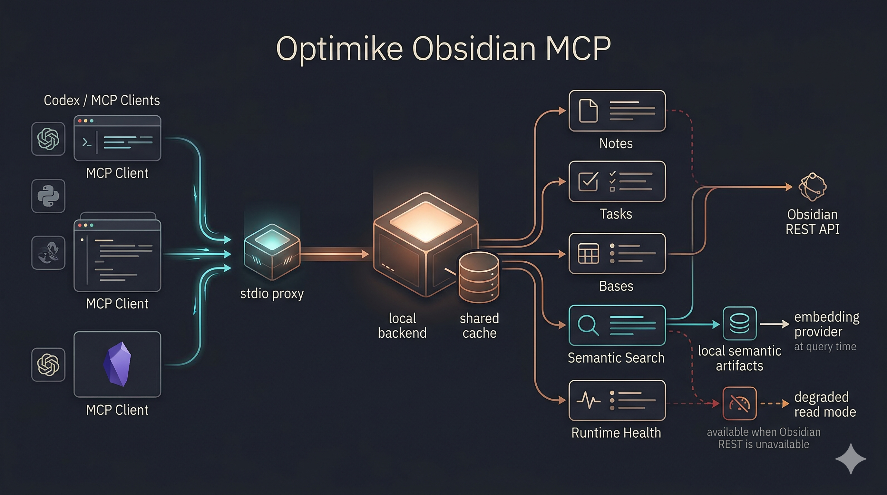

# Guide d’exploitation Optimike Obsidian MCP

Version anglaise : [OPERATIONS.md](OPERATIONS.md)



Ce guide explique comment le serveur tourne réellement, de quoi il dépend, comment Tasks et la recherche sémantique fonctionnent, et ce qui permet de garder une faible empreinte mémoire.

## Modèle runtime

Le runtime final repose sur deux couches :

1. `dist/stdio-proxy.js`
   - wrapper stdio léger pour Codex et les autres clients MCP
   - démarre ou réutilise le backend local
   - garde la partie client MCP peu coûteuse
2. `dist/index.js` en mode HTTP
   - backend local long-lived
   - possède le store SQLite partagé
   - gère les refreshs, le mode dégradé et la santé runtime

C’est la raison principale pour laquelle le serveur consomme maintenant moins de mémoire dans Codex : l’état lourd du vault n’est plus reconstruit dans chaque process stdio enfant.

## Ce qui vit sur disque

Store partagé par défaut :

```text
<vault>/.obsidian/optimike-mcp/shared-cache.sqlite
```

Le store partagé contient :

- `file_cache` : contenu et métadonnées des notes
- `task_file_cache` : données Tasks parsées et réutilisées par `list_all_tasks` et `query_tasks`
- `semantic_manifest` : métadonnées sémantiques pour éviter des rescans `.smart-env` inutiles
- `semantic_vectors` : métadonnées côté vecteurs

Ce qui reste en RAM :

- uniquement le backend actif
- un hot cache de contenu borné
- un petit état runtime pour le mode dégradé, la disponibilité sémantique et les refreshs récents

## Comment la mémoire reste basse

Le design final réduit la mémoire de quatre façons :

1. le `stdio` est devenu léger

   - Codex parle à `stdio-proxy.js`
   - le backend lourd est réutilisé au lieu d’être relancé

2. le contenu des notes est persisté

   - le serveur ne garde plus tout le vault chaud en mémoire
   - le contenu est lu depuis SQLite d’abord, puis depuis le disque ou REST seulement si nécessaire

3. Tasks réutilise la même couche persistée

   - le parsing Tasks relit le contenu partagé des notes
   - le serveur évite un second chemin de scan brutal pour un autre MCP Tasks

4. les refreshs sémantiques sont incrémentaux
   - les métadonnées sémantiques sont persistées
   - les warm refreshs consultent SQLite avant de reparcourir tout `.smart-env`

Variables de tuning utiles :

- `OBSIDIAN_RUNTIME_MODE=live|hybrid|headless-readonly|headless-guarded`
- `OBSIDIAN_CONTENT_HOT_CACHE_LIMIT`
- `OBSIDIAN_SHARED_CACHE_DB_PATH`
- `OBSIDIAN_CACHE_SOURCE=auto|filesystem|rest`
- `OBSIDIAN_CACHE_CONCURRENCY`
- `MCP_WRITE_MODE=readonly|guarded|full`
- `MCP_GUARDED_MAX_WRITE_CHARS`
- `MCP_GUARDED_MAX_BATCH_OPERATIONS`
- `OBSIDIAN_STARTUP_BLOCKING=false` pour un démarrage non bloquant plus confortable sous WSL

Le comportement d’écriture par défaut est `MCP_WRITE_MODE=full`. Les hôtes qui veulent une posture publique/runtime plus stricte peuvent définir explicitement `MCP_WRITE_MODE=guarded` ou `MCP_WRITE_MODE=readonly` ; l’agent n’a pas à choisir un mode à chaque écriture.

Pour valider sur un vrai coffre, garder `OBSIDIAN_SHARED_CACHE_DB_PATH` hors du coffre synchronisé. Cela permet de tester readonly, hybrid et les flows guarded en sandbox sans ajouter de base SQLite de validation dans le vault.

## Modes runtime

- `live` : mode complet par défaut. Requiert Obsidian Desktop + Local REST API + `OBSIDIAN_API_KEY`.
- `hybrid` : Local REST API optionnelle et non bloquante. Si l’API est configurée, les tools live sont exposées ; sinon `OBSIDIAN_VAULT` est requis et la surface cache/filesystem reste disponible.
- `headless-readonly` : requiert `OBSIDIAN_VAULT`; ne requiert ni Obsidian Desktop, ni Local REST API, ni `OBSIDIAN_API_KEY`; expose lecture, liste, recherche, Tasks, sémantique, runtime et fallback local Bases readonly.
- `headless-guarded` : même surface read headless, plus écritures filesystem bornées pour `obsidian_update_note`, `obsidian_search_replace` et `obsidian_manage_frontmatter`. Les updates de note sont limitées à append/prepend ; overwrite reste bloqué par la politique guarded. Le fallback local Bases readonly est aussi disponible.

Règle opérationnelle : les modes headless signifient Optimike MCP au-dessus d’un vault Markdown synchronisé. Ils ne chargent pas les plugins communautaires Obsidian et ne fournissent pas active file, command palette ou Bases Bridge sans Desktop.

Smokes runtime :

```bash
npm run test:runtime
npm run smoke:headless-readonly
npm run smoke:hybrid-unavailable
npm run smoke:hybrid-api-available
npm run smoke:headless-guarded
npm run smoke:headless-status
```

`npm run test:runtime` est la gate locale durable pour cette famille runtime. Elle lance `npm run build`, les smokes de mode et le smoke HTTP health/status sur des vaults temporaires.

## Dépendances requises

Le serveur final peut exposer des capacités différentes selon les plugins Obsidian et services locaux disponibles.

### Dépendance Obsidian de base

- accès au vault via `OBSIDIAN_VAULT`

### Plugins Obsidian

- Local REST API

  - utilisé pour la majorité des opérations live sur les notes
  - configuré via `OBSIDIAN_BASE_URL` et `OBSIDIAN_API_KEY`

- Bases Bridge (REST)

  - requis pour les écritures `.base` live et le comportement complet des requêtes via bridge
  - expose les endpoints Bases consommés par ce MCP

- Fallback local Bases

  - disponible en modes headless pour `bases_list`, `bases_get_schema` et `bases_query`
  - renvoie `source: "local-fallback"`
  - supporte les filtres par égalité directe, le tri simple, la pagination et l’inspection de schéma
  - n’évalue pas les formules, filtres plugin, propriétés calculées ni la sémantique exacte des vues UI

- Smart Connections
  - requis pour la recherche sémantique
  - les artefacts attendus vivent sous :

```text
<vault>/.smart-env
```

- plugin Obsidian Tasks
  - requis pour un comportement Tasks canonique
  - fichier de config attendu :

```text
<vault>/.obsidian/plugins/obsidian-tasks-plugin/data.json
```

## Tasks : comment ça marche maintenant

Tasks n’est plus un MCP séparé requis pour Codex.

Le MCP principal expose maintenant :

- `list_all_tasks`
- `query_tasks`

Chemin d’exécution :

1. le contenu des notes est synchronisé dans `file_cache`
2. le parsing Tasks réutilise ce contenu
3. les tâches parsées sont écrites dans `task_file_cache`
4. les requêtes Tasks réutilisent cette couche persistée au lieu de rescanner tout le vault sur le chemin chaud

Résultat :

- une seule entrée MCP dans Codex
- un seul backend local
- un seul modèle de données persisté

Le repo legacy `optimike-obsidian-tasks-mcp` peut encore exister, mais Codex n’en a plus besoin quand ce serveur principal est utilisé.

## Recherche sémantique : ce qui est persisté et ce qui ne l’est pas

La recherche sémantique est plus rapide et plus stable qu’avant, mais une dépendance reste toujours vivante au moment de la requête.

Persisté :

- manifest sémantique
- métadonnées vecteurs
- dimension dominante et état de cache associé
- snapshot sémantique en mémoire pendant `SMART_ENV_CACHE_TTL_MS`
- normes de vecteurs pour accélérer les classements répétés

Toujours vivant au moment de la requête :

- le provider d’embedding pour la requête

Exemples :

- si ton vault sémantique repose sur Ollama, Ollama doit toujours être joignable pour exécuter une requête sémantique
- si Ollama tombe, le MCP renvoie maintenant une erreur propre au lieu de sembler freezer

Au démarrage, le backend préchauffe la recherche sémantique en chargeant le snapshot et en envoyant une petite requête d’embedding au provider configuré. Désactivation possible avec `SEMANTIC_SEARCH_PREWARM=false` ; texte de warmup surchargeable avec `SEMANTIC_SEARCH_PREWARM_TEXT`.

## Mode dégradé

Si Obsidian REST n’est plus joignable mais que le cache partagé est chaud, le backend peut encore servir des opérations de lecture seule pour :

- `obsidian_read_note`
- `obsidian_list_notes`

Le but est de garder le MCP utile quand Obsidian tombe temporairement, tout en rendant l’état explicite.

Si une première lecture ou recherche arrive pendant que le cache filesystem est encore en construction, la tool attend brièvement la readiness du cache puis renvoie les stats cache si le vault reste indisponible. Sur gros coffre, utiliser `obsidian_runtime_maintenance` avec `refresh_all` comme gate manuelle de readiness.

## Santé et maintenance

### Health HTTP

```bash
curl http://127.0.0.1:3010/healthz
curl http://127.0.0.1:3010/healthz?integrity=1
```

Ce que tu obtiens :

- mode runtime
- fingerprint runtime : version package, git sha, Node, chemins `dist`, hash de config non sensible
- état du mode dégradé
- stats de cache
- stats sémantiques
- résultat d’intégrité SQLite si demandé

### Tools MCP runtime

- `obsidian_runtime_status`
- `obsidian_runtime_maintenance`

Actions de maintenance supportées :

- `integrity_check`
- `run_maintenance`
- `refresh_vault_cache`
- `refresh_semantic_cache`
- `refresh_tasks_cache`
- `refresh_all`

### Vérification automatisée locale

Le script de smoke local vérifie le runtime tel qu’il est réellement utilisé :

```bash
npm run smoke:runtime
```

Il contrôle :

- `/healthz?integrity=1`
- le fingerprint runtime
- la fraîcheur du process par rapport aux fichiers `dist`
- l’intégrité SQLite
- la découverte des tools via MCP HTTP
- la découverte des tools via `stdio-proxy`

Pour vérifier le code avant PR ou merge :

```bash
npm run test:runtime
npm run verify:code
```

`npm run test:runtime` enchaîne :

- `npm run build`
- smoke headless readonly
- smoke hybrid sans API
- smoke hybrid avec API simulée
- smoke headless guarded

`npm run verify:code` enchaîne :

- `npm audit`
- `npm run build`

Ensuite, redémarre le backend si le build vient de modifier `dist`, puis lance :

```bash
npm run smoke:runtime
```

Le smoke échoue volontairement si le process backend est plus vieux que les fichiers `dist`.

## Setup Codex minimal

Codex doit pointer vers :

```toml
[mcp_servers.optimike-obsidian-mcp-stdio]
command = "node"
args = ["/path/to/optimike-obsidian-mcp/dist/stdio-proxy.js"]
```

Variables importantes :

- `MCP_HTTP_HOST`
- `MCP_HTTP_PORT`
- `MCP_PROXY_START_TIMEOUT_MS`
- `OBSIDIAN_VAULT`
- `SMART_ENV_DIR`
- `OBSIDIAN_BASE_URL`
- `OBSIDIAN_API_KEY`

Comportement de démarrage recommandé :

```toml
OBSIDIAN_STARTUP_BLOCKING = "false"
```

Ça garde le démarrage de Codex réactif pendant que le health check du backend finit en arrière-plan.

## Dépannage

### La recherche sémantique échoue

Vérifie :

- `SMART_ENV_DIR`
- la disponibilité du provider d’embedding
- l’état runtime via `obsidian_runtime_status`

### Les résultats Tasks semblent stale

Lance :

- `obsidian_runtime_maintenance` avec `refresh_tasks_cache`

### Les notes se lisent mais les mises à jour live échouent

État probable :

- mode dégradé lecture actif
- Obsidian REST down ou injoignable

Vérifie :

- `OBSIDIAN_BASE_URL`
- le plugin Local REST API
- `obsidian_runtime_status`

### La mémoire grimpe trop

Vérifie :

- que les clients pointent vers `dist/stdio-proxy.js` et non `dist/index.js`
- la limite de hot cache via `OBSIDIAN_CONTENT_HOT_CACHE_LIMIT`
- qu’un ancien backend MCP ne tourne pas encore

## Modèle mental recommandé

Pense au serveur comme :

- une seule surface MCP
- un seul backend réutilisable
- un seul état local persisté
- un provider sémantique live en option

C’est la forme finale visée du produit.
