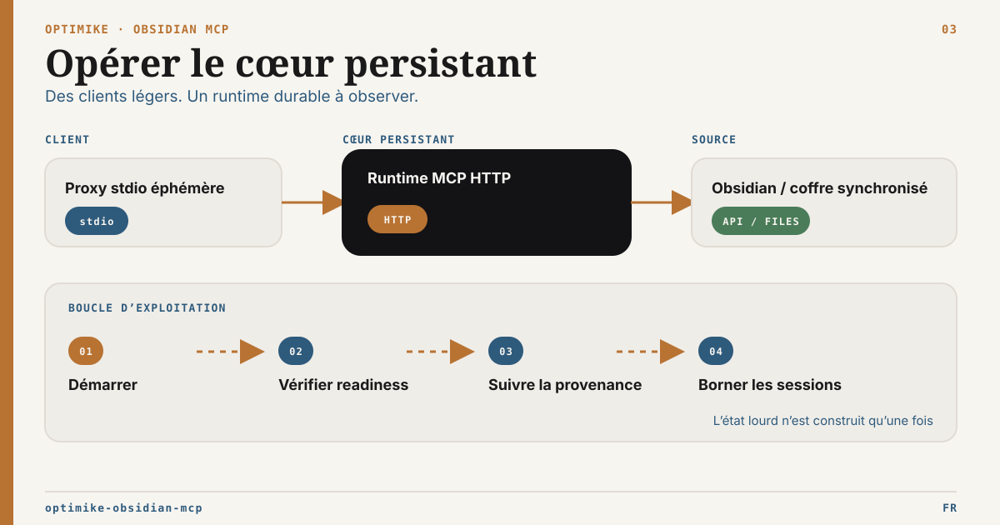

# Guide d’exploitation Optimike Obsidian MCP

Version anglaise : [OPERATIONS.md](OPERATIONS.md)



Ce guide explique comment le serveur tourne réellement, de quoi il dépend, comment Tasks et la recherche sémantique fonctionnent, et ce qui permet de garder une faible empreinte mémoire.

## Modèle runtime

Le runtime final repose sur deux couches :

1. `dist/stdio-proxy.js`
   - wrapper stdio léger pour Codex et les autres clients MCP
   - démarre ou réutilise le backend local
   - garde la partie client MCP peu coûteuse
2. `dist/index.js` en mode HTTP
   - backend local persistant
   - possède le store SQLite partagé
   - gère les refreshs, le mode dégradé et la santé runtime

C’est la raison principale pour laquelle le serveur consomme maintenant moins de mémoire dans Codex : l’état lourd du vault n’est plus reconstruit dans chaque process stdio enfant.

## Ce qui vit sur disque

Store partagé par défaut :

```text
<vault>/.obsidian/optimike-mcp/shared-cache.sqlite
```

Le store partagé contient :

- `file_cache` : contenu et métadonnées des notes
- `task_file_cache` : données Tasks parsées et réutilisées par `list_all_tasks` et `query_tasks`
- `semantic_manifest` : métadonnées sémantiques pour éviter des rescans `.smart-env` inutiles
- `semantic_vectors` : métadonnées côté vecteurs

Ce qui reste en RAM :

- uniquement le backend actif
- un cache chaud de contenu borné
- un petit état runtime pour le mode dégradé, la disponibilité sémantique et les refreshs récents

## Comment la mémoire reste basse

Le design final réduit la mémoire de quatre façons :

1. le `stdio` est devenu léger

   - Codex parle à `stdio-proxy.js`
   - le backend lourd est réutilisé au lieu d’être relancé

2. le contenu des notes est persisté

   - le serveur ne garde plus tout le vault chaud en mémoire
   - le contenu est lu depuis SQLite d’abord, puis depuis le disque ou REST seulement si nécessaire

3. Tasks réutilise la même couche persistée

   - le parsing Tasks relit le contenu partagé des notes
   - le serveur évite un second chemin de scan brutal pour un autre MCP Tasks

4. les refreshs sémantiques sont incrémentaux
   - les métadonnées sémantiques sont persistées
   - les refreshs à chaud consultent SQLite avant de reparcourir tout `.smart-env`

Variables de réglage utiles :

- `OBSIDIAN_RUNTIME_MODE=live|hybrid|headless-readonly|headless-guarded|headless-filesystem`
- `OBSIDIAN_CONTENT_HOT_CACHE_LIMIT`
- `OBSIDIAN_SHARED_CACHE_DB_PATH`
- `OBSIDIAN_CACHE_SOURCE=auto|filesystem|rest`
- `OBSIDIAN_CACHE_CONCURRENCY`
- `OBSIDIAN_VAULT_EXCLUDE_PATTERNS`
- `MCP_WRITE_MODE=readonly|guarded|full`
- `MCP_GUARDED_MAX_WRITE_CHARS`
- `MCP_GUARDED_MAX_BATCH_OPERATIONS`
- `OBSIDIAN_STARTUP_BLOCKING=false` pour un démarrage non bloquant plus confortable

Le comportement d’écriture par défaut est `MCP_WRITE_MODE=full`. Les hôtes qui veulent une posture publique plus stricte peuvent définir explicitement `MCP_WRITE_MODE=guarded` ou `MCP_WRITE_MODE=readonly` ; l’agent n’a pas à choisir un mode à chaque écriture.

Pour valider sur un vrai coffre, garder `OBSIDIAN_SHARED_CACHE_DB_PATH` hors du coffre synchronisé. Cela permet de tester readonly, hybrid et les flows guarded en sandbox sans ajouter de base SQLite de validation dans le vault.

## Politique d’exclusion du vault

Le serveur embarque une politique d’exclusion pour les scans runtime filesystem. Elle évite d’indexer le bruit opérationnel et les artefacts de validation :

- `.obsidian`, `.trash`, `.git`
- `.tmp`, `tmp`, `node_modules`
- dossiers de screenshots, dossiers build/cache, fichiers SQLite/DB et fichiers log

Ajouter des règles locales avec `OBSIDIAN_VAULT_EXCLUDE_PATTERNS`, au format gitignore séparé par virgules ou retours ligne. Exemple :

```bash
OBSIDIAN_VAULT_EXCLUDE_PATTERNS="tmp/**,**/tmp/**,Efforts/Archives/**"
npm run check:vault-exclusions -- --vault=/chemin/vers/vault
```

Cette politique protège le cache Optimike, la recherche, Tasks et le fallback local Bases. Elle n’empêche pas Obsidian Headless/Sync de télécharger les fichiers. Pour un serveur durable, commencer par un vault copié en pull-only, puis nettoyer le contenu côté Sync ou utiliser un profil/vault serveur spécifique avant toute validation d’écriture guarded.

## Modes runtime

- `live` : mode complet par défaut. Requiert Obsidian Desktop + Local REST API + `OBSIDIAN_API_KEY`.
- `hybrid` : Local REST API optionnelle et non bloquante. Si l’API est configurée, les tools live sont exposées ; sinon `OBSIDIAN_VAULT` est requis et la surface cache/filesystem reste disponible.
- `headless-readonly` : requiert `OBSIDIAN_VAULT`; ne requiert ni Obsidian Desktop, ni Local REST API, ni `OBSIDIAN_API_KEY`; expose lecture, liste, recherche, Tasks, sémantique, runtime et fallback local Bases en lecture seule.
- `headless-guarded` : même surface de lecture headless, plus écritures filesystem bornées pour `obsidian_update_note`, `obsidian_search_replace` et `obsidian_manage_frontmatter`. Les updates de note sont limitées à append/prepend ; overwrite reste bloqué par la politique guarded. Le fallback local Bases en lecture seule est aussi disponible.
- `headless-filesystem` : même surface que `headless-guarded`, avec des fonctions filesystem explicites pour sandbox ou vault dédié : tags frontmatter/inline, index/audit local des tags, rename en dry-run, opérations admin move/archive/delete avec `expectedHash` ou `expectedMtime`, batch frontmatter avec dry-run, création/config YAML `.base`, rows Bases comme opérations `set` de frontmatter Markdown, et helpers JSON Canvas minimaux.

Règle opérationnelle : les modes headless signifient Optimike MCP au-dessus d’un vault Markdown synchronisé. Ils ne chargent pas les plugins communautaires Obsidian et ne fournissent pas active file, command palette ou Bases Bridge sans Desktop.

Smokes runtime :

```bash
npm run test:runtime
npm run smoke:headless-readonly
npm run smoke:hybrid-unavailable
npm run smoke:hybrid-api-available
npm run smoke:headless-guarded
npm run smoke:headless-filesystem
npm run smoke:headless-status
npm run check:vault-exclusions -- --vault=/chemin/vers/vault
npm run test:headless-long-run
npm run snapshot:vault
npm pack --dry-run
```

`npm run test:runtime` est la gate locale durable pour cette famille runtime. Elle lance `npm run build`, les smokes de mode et le smoke HTTP health/status sur des vaults temporaires. Les smokes headless vérifient aussi qu’un contenu exclu sous `tmp/**` n’est pas indexé.

`npm run test:http-headless-multiclient` est la gate HTTP multi-client sur un coffre
jetable en lecture seule. Le runbook terrain et la frontière exacte avec
Desktop/plugins sont documentés dans
[Pilote Linux headless multi-client](docs/headless-multiclient-pilot.fr.md).

Le comparatif détaillé par mode vit dans [Matrice des capacités runtime](docs/runtime-capability-matrix.fr.md).
Le runbook serveur dédié vit dans [Profil serveur headless](docs/headless-server-profile.fr.md).
Le routage agent vit dans [Guide de routage MCP](docs/mcp-routing-guide.fr.md).

Utiliser `obsidian_validate_format` avant d'écrire du contenu Markdown, `.base` ou `.canvas` généré. Il valide la syntaxe/forme locale ; le rendu Desktop, le comportement plugin et la sémantique exacte de l'UI Bases nécessitent toujours Obsidian Desktop.

## Dépendances requises

Le serveur final peut exposer des capacités différentes selon les plugins Obsidian et services locaux disponibles.

### Dépendance Obsidian de base

- accès au vault via `OBSIDIAN_VAULT`

### Plugins Obsidian

- Local REST API

  - utilisé pour la majorité des opérations live sur les notes
  - configuré via `OBSIDIAN_BASE_URL` et `OBSIDIAN_API_KEY`

- Bases Bridge (REST)

  - requis pour les écritures `.base` live et le comportement complet des requêtes via bridge
  - expose les endpoints Bases consommés par ce MCP

- Fallback local Bases

  - disponible en modes headless pour `bases_list`, `bases_get_schema` et `bases_query`
  - renvoie `source: "local-fallback"`

- supporte l’égalité directe, les arrays, `contains`, `in`, les comparaisons, le tri simple, la pagination et l’inspection de schéma

  - n’évalue pas les formules, filtres plugin, propriétés calculées ni la sémantique exacte des vues UI

- Smart Connections
  - requis pour la recherche sémantique
  - les artefacts attendus vivent sous :

```text
<vault>/.smart-env
```

- plugin Obsidian Tasks
  - requis pour un comportement Tasks canonique
  - fichier de config attendu :

```text
<vault>/.obsidian/plugins/obsidian-tasks-plugin/data.json
```

## Remplacement atomique gouverné d’une note

Les outils live `obsidian_note_replace_*` exposent l’adaptateur atomique 2.5
sans créer un second moteur de transaction. Un seul journal process-wide est
partagé par stdio et toutes les sessions HTTP MCP. Son chemin par défaut reste
local à la machine ; `MCP_OBSIDIAN_NOTE_REPLACE_JOURNAL_PATH` doit être absolu
et rester hors du coffre, des dépôts, dossiers synchronisés et diagnostics
publics.
Le nom de fichier par défaut est séparé par une empreinte non secrète du mode
runtime, de l’URL REST et du chemin de coffre configurés. Définir l’identité
logique stable optionnelle `MCP_OBSIDIAN_NOTE_REPLACE_PROFILE_ID` lorsque la
topologie de déploiement exige un profil backend explicite.
Les plans `applying` utilisent un bail durable avec heartbeat de l'instance
runtime. La valeur par défaut
`MCP_OBSIDIAN_NOTE_REPLACE_EXECUTION_LEASE_MS=30000` retarde le recovery après
crash de 30 secondes au maximum afin qu'un PID réutilisé ou un heartbeat
brièvement retardé n'autorise pas un recovery concurrent. Ne la réduire que
pour un runtime contrôlé offrant des garanties de latence plus strictes.

Séquence client :

1. `obsidian_note_replace_plan(path, nextContent, idempotencyKey)` ;
2. `obsidian_note_replace_apply(planRef, idempotencyKey)` ;
3. après timeout ou réponse perdue, appeler `obsidian_note_replace_status` ;
4. appeler `obsidian_note_replace_recover` uniquement si le reçu autorise la
   récupération du plan exact.

Le `planRef` est opaque. Apply et recover n’acceptent jamais une nouvelle cible,
un nouveau contenu ou un nouveau hash. Recover réconcilie ou reprend le même
plan scellé ; ce n’est pas un undo. La politique MCP courante, le frontmatter
protégé et le write gate désactivé par défaut de l’Atomic Write Bridge restent
actifs au planning et avant chaque effet possible.

Avant merge ou release, activer l’Atomic Write Bridge uniquement dans un coffre
Desktop jetable, créer une note canary `.md` existante et dédiée, puis exécuter
dans PowerShell :

```powershell
$env:OBSIDIAN_ATOMIC_NOTE_CANARY_PATH="Canary/Atomic Note.md"
$env:OBSIDIAN_ATOMIC_NOTE_CANARY_CONFIRM="I_UNDERSTAND_THIS_NOTE_WILL_BE_TEMPORARILY_REPLACED"
$env:OBSIDIAN_API_KEY="<cle-local-rest-api>"
$env:MCP_WRITE_MODE="guarded"
npm run smoke:atomic-note-mcp-live
```

Le canary sauvegarde le contenu initial avant sa première mutation, prouve les
quatre outils MCP, le refus d’un CAS Bridge périmé, l’apply nominal, le replay,
status, un conflit déterministe et la restauration. Un succès écrit la preuve
JSON expurgée directement sous la racine temporaire du système, affiche son
`evidenceFile` exact, puis supprime le dossier privé qui contenait journal, logs
et sauvegarde. Un échec géré avant mutation supprime aussi ce dossier après
avoir vérifié que la note est inchangée. Une interruption brutale ou une
restauration non vérifiée conserve le dossier privé au chemin de récupération
affiché au démarrage ; ne restaurer qu’à partir des métadonnées explicites de sa
sauvegarde. Ne jamais viser une note utilisateur ordinaire.

## Frontmatter gouvernée P1

P1 accepte des intentions top-level `set`/`delete` bornées et les compile sans
resérialiser globalement le YAML. Tous les bytes hors cible restent identiques.
La séquence sûre est `obsidian_frontmatter_patch_plan → apply → status →
recover` ; après une réponse incertaine, appeler d’abord status. Le reçu P1
projette le même child plan et le même journal P0.

Gates déterministes :

```bash
npm run test:governed-frontmatter
```

Canary live sur une note explicitement jetable :

```powershell
$env:OBSIDIAN_FRONTMATTER_CANARY_PATH = "Canary/Frontmatter P1.md"
$env:OBSIDIAN_FRONTMATTER_CANARY_CONFIRM = "I_UNDERSTAND_THIS_NOTE_WILL_BE_TEMPORARILY_PATCHED"
$env:OBSIDIAN_API_KEY = "<cle-local-rest-api>"
$env:MCP_WRITE_MODE = "guarded"
npm run smoke:governed-frontmatter-live
```

Le script annonce un dossier temporaire système de récupération, écrit un
backup privé avant mutation, prouve add/set/delete, replay/status/conflit périmé
et la restauration exacte du SHA, puis ne supprime le dossier privé qu’après
vérification de la restauration.

## Tasks : comment ça marche maintenant

Tasks n’est plus un MCP séparé requis pour Codex.

Le MCP principal expose maintenant :

- `list_all_tasks`
- `query_tasks`

Chemin d’exécution :

1. le contenu des notes est synchronisé dans `file_cache`
2. le parsing Tasks réutilise ce contenu
3. les tâches parsées sont écrites dans `task_file_cache`
4. les requêtes Tasks réutilisent cette couche persistée au lieu de rescanner tout le vault sur le chemin chaud

Résultat :

- une seule entrée MCP dans Codex
- un seul backend local
- un seul modèle de données persisté

Le repo legacy `optimike-obsidian-tasks-mcp` peut encore exister, mais Codex n’en a plus besoin quand ce serveur principal est utilisé.

## Recherche sémantique : ce qui est persisté et ce qui ne l’est pas

La recherche sémantique est plus rapide et plus stable qu’avant, mais une dépendance reste toujours vivante au moment de la requête.

Persisté :

- manifest sémantique
- métadonnées vecteurs
- dimension dominante et état de cache associé
- snapshot sémantique en mémoire pendant `SMART_ENV_CACHE_TTL_MS`
- normes de vecteurs pour accélérer les classements répétés

Toujours vivant au moment de la requête :

- le provider d’embedding pour la requête

Exemples :

- si ton vault sémantique repose sur Ollama, Ollama doit toujours être joignable pour exécuter une requête sémantique
- si Ollama tombe, le MCP renvoie maintenant une erreur propre au lieu de sembler bloqué

Au démarrage, le backend préchauffe la recherche sémantique en chargeant le snapshot et en envoyant une petite requête d’embedding au provider configuré. Désactivation possible avec `SEMANTIC_SEARCH_PREWARM=false` ; texte de warmup surchargeable avec `SEMANTIC_SEARCH_PREWARM_TEXT`.

## Mode dégradé

Si Obsidian REST n’est plus joignable mais que le cache partagé est chaud, le backend peut encore servir des opérations de lecture seule pour :

- `obsidian_read_note`
- `obsidian_list_notes`

Le but est de garder le MCP utile quand Obsidian tombe temporairement, tout en rendant l’état explicite.

Si une première lecture ou recherche arrive pendant que le cache filesystem est encore en construction, la tool attend brièvement que le cache soit prêt, puis renvoie les stats cache si le vault reste indisponible. Sur gros coffre, utiliser `obsidian_runtime_maintenance` avec `refresh_all` comme gate manuelle de readiness.

## Santé et maintenance

### Health HTTP

```bash
curl http://127.0.0.1:3010/healthz
```

L’endpoint public ne retourne qu’un signal de vie minimal sans chemin. Utiliser
les outils MCP authentifiés pour obtenir :

- mode runtime
- fingerprint runtime : version package, git sha, Node, chemins `dist`, hash de config non sensible
- état du mode dégradé
- stats de cache
- stats sémantiques
- résultat d’intégrité SQLite si demandé

### Tools MCP runtime

- `obsidian_runtime_status`
- `obsidian_runtime_maintenance`

Actions de maintenance supportées :

- `integrity_check`
- `run_maintenance`
- `refresh_vault_cache`
- `refresh_semantic_cache`
- `refresh_tasks_cache`
- `refresh_all`

### Vérification automatisée locale

Le script de smoke local vérifie le runtime tel qu’il est réellement utilisé :

```bash
npm run smoke:runtime
```

Il contrôle :

- le signal de vie minimal et sans chemin de `/healthz`
- la découverte des tools via MCP HTTP
- la découverte des tools via `stdio-proxy`

`npm run smoke:headless-status`, inclus dans `npm run test:runtime`, contrôle le
statut runtime authentifié, la fraîcheur du process et la disponibilité du cache
partagé.

Pour vérifier le code avant PR ou merge :

```bash
npm run test:runtime
npm run verify:code
```

`npm run test:runtime` enchaîne :

- `npm run build`
- smoke headless readonly
- smoke hybrid sans API
- smoke hybrid avec API simulée
- smoke headless guarded
- smoke headless filesystem
- smoke HTTP health/status

`npm run verify:code` enchaîne :

- `npm audit`
- `npm run build`

Pour vérifier la supply chain, lance aussi :

```bash
npm audit signatures
```

Résultat attendu sur l’arbre de dépendances verrouillé : 0 vulnérabilité npm
connue, signatures registry vérifiées et build TypeScript réussi. Traite tout
HTTP loopback direct est supporté avec limites. Tout profil LAN ou distant reste
pilote derrière un reverse proxy TLS revu, une identité JWT/OAuth réelle, des
origins explicites, une supervision et des contrôles réseau. L’exposition
publique directe du processus Node n’est pas supportée ; `0.0.0.0` ne constitue
pas une frontière de déploiement.

Ensuite, redémarre le backend si le build vient de modifier `dist`, puis lance :

```bash
npm run smoke:runtime
```

Le smoke échoue volontairement si le process backend est plus vieux que les fichiers `dist`.

## Setup Codex minimal

Codex doit pointer vers :

```toml
[mcp_servers.optimike-obsidian-mcp-stdio]
command = "node"
args = ["/path/to/optimike-obsidian-mcp/dist/stdio-proxy.js"]

[mcp_servers.optimike-obsidian-mcp-stdio.env]
# Optionnel : chemin absolu vers un JSON external-roots local à la machine
MCP_EXTERNAL_ROOTS_FILE = "/home/vous/.config/optimike/external-roots.json"
```

Variables importantes :

- `MCP_HTTP_HOST`
- `MCP_HTTP_PORT`
- `MCP_PROXY_START_TIMEOUT_MS`
- `OBSIDIAN_VAULT`
- `SMART_ENV_DIR`
- `OBSIDIAN_BASE_URL`
- `OBSIDIAN_API_KEY`
- `MCP_EXTERNAL_ROOTS_FILE`

Comportement de démarrage recommandé :

```toml
OBSIDIAN_STARTUP_BLOCKING = "false"
```

Ça garde le démarrage de Codex réactif pendant que le health check du backend finit en arrière-plan.

## Runbook des racines documentaires externes

Les racines externes forment une frontière optionnelle, default-deny et en
lecture seule pour des fichiers qui restent légitimement hors du coffre. Elles
ne sont ni un index externe, ni un moteur de synchronisation, ni une sauvegarde.

1. Copier `docs/external-roots.example.json` vers un chemin local à la machine,
   hors du dépôt.
2. Configurer les identifiants logiques, capacités, politiques include/exclude
   et limites. Ne jamais committer le vrai fichier.
3. Définir son chemin absolu dans `MCP_EXTERNAL_ROOTS_FILE` sur le processus
   `dist/stdio-proxy.js`.
4. Redémarrer le processus MCP. La configuration n’est pas rechargée à chaud.
5. Vérifier `external_runtime_status`, `external_roots_list`, un listing borné,
   une lecture UTF-8 et, seulement si nécessaire, un handoff explicite.

Pour le schéma complet, les exemples Windows et Unix, la compatibilité client,
le cycle de sécurité, le rollback, les niveaux de smoke test et le dépannage,
voir
[Racines documentaires externes — configuration et exploitation](docs/external-roots-setup.fr.md).

Pour désactiver la fonction, retirer `MCP_EXTERNAL_ROOTS_FILE`, redémarrer et
confirmer que `external_runtime_status` indique `enabled: false`. Cette opération
ne modifie aucun document source.

## Dépannage

### La recherche sémantique échoue

Vérifie :

- `SMART_ENV_DIR`
- la disponibilité du provider d’embedding
- l’état runtime via `obsidian_runtime_status`

### Les résultats Tasks semblent stale

Lance :

- `obsidian_runtime_maintenance` avec `refresh_tasks_cache`

### Les notes se lisent mais les mises à jour live échouent

État probable :

- mode dégradé lecture actif
- Obsidian REST down ou injoignable

Vérifie :

- `OBSIDIAN_BASE_URL`
- le plugin Local REST API
- `obsidian_runtime_status`

### La mémoire grimpe trop

Vérifie :

- que les clients pointent vers `dist/stdio-proxy.js` et non `dist/index.js`
- la limite du cache chaud via `OBSIDIAN_CONTENT_HOT_CACHE_LIMIT`
- qu’un ancien backend MCP ne tourne pas encore

## Modèle mental recommandé

Pense au serveur comme :

- une seule surface MCP
- un seul backend réutilisable
- un seul état local persisté
- un provider sémantique live en option

C’est la forme visée du produit.

## Documentation complémentaire

- Hub documentaire : [docs/README.fr.md](docs/README.fr.md)
- Vue produit et installation : [README.fr.md](README.fr.md)
- Sécurité et frontière de déploiement : [SECURITY.fr.md](SECURITY.fr.md)
- Matrice des capacités par mode : [docs/runtime-capability-matrix.fr.md](docs/runtime-capability-matrix.fr.md)
- Profil serveur headless dédié : [docs/headless-server-profile.fr.md](docs/headless-server-profile.fr.md)
- Guide de routage agent : [docs/mcp-routing-guide.fr.md](docs/mcp-routing-guide.fr.md)
- Racines externes et handoff : [docs/external-roots-setup.fr.md](docs/external-roots-setup.fr.md)
- Guide d’exploitation anglais : [OPERATIONS.md](OPERATIONS.md)
