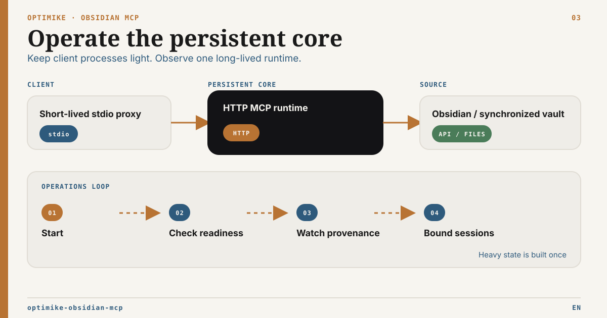

# Optimike Obsidian MCP Operations Guide

French version: [OPERATIONS.fr.md](OPERATIONS.fr.md)



This guide explains how the server actually runs, what it depends on, how Tasks and semantic search work, and what keeps the runtime memory footprint low.

## Runtime Model

The final runtime uses two layers:

1. `dist/stdio-proxy.js`
   - short-lived stdio wrapper for Codex and similar MCP clients
   - starts or reuses the local backend
   - keeps the MCP client side cheap
2. `dist/index.js` in HTTP mode
   - long-lived local backend
   - owns the shared SQLite store
   - owns cache refresh, degraded mode, and runtime health

This is the main reason the server now uses much less memory in Codex sessions: heavy vault state is no longer rebuilt inside every stdio child process.

## What Lives On Disk

Default shared store:

```text
<vault>/.obsidian/optimike-mcp/shared-cache.sqlite
```

The shared store contains:

- `file_cache`: persisted note content and metadata
- `task_file_cache`: parsed Tasks data reused by `list_all_tasks` and `query_tasks`
- `semantic_manifest`: semantic metadata used to avoid unnecessary `.smart-env` rescans
- `semantic_vectors`: persisted vector-side metadata

What stays in RAM:

- only the active backend process
- a bounded hot content cache
- small runtime state for degraded mode, semantic readiness, and recent refreshes

## How Memory Is Kept Low

The final design reduces memory usage in four ways:

1. `stdio` is now cheap

   - Codex talks to `stdio-proxy.js`
   - the heavy backend is reused instead of respawned

2. note content is persisted

   - the server does not keep the whole vault hot in memory
   - note content is loaded from SQLite first, then from disk or REST only when needed

3. Tasks reuse the same persisted content

   - task parsing reads from shared cached note content
   - the server avoids a second brute-force scan path for a separate Tasks MCP

4. semantic refreshes are incremental
   - semantic metadata is persisted
   - warm refreshes consult SQLite first instead of fully rebuilding from `.smart-env`

Useful tuning:

- `OBSIDIAN_RUNTIME_MODE=live|hybrid|headless-readonly|headless-guarded|headless-filesystem`
- `OBSIDIAN_CONTENT_HOT_CACHE_LIMIT`
- `OBSIDIAN_SHARED_CACHE_DB_PATH`
- `OBSIDIAN_CACHE_SOURCE=auto|filesystem|rest`
- `OBSIDIAN_CACHE_CONCURRENCY`
- `OBSIDIAN_VAULT_EXCLUDE_PATTERNS`
- `MCP_WRITE_MODE=readonly|guarded|full`
- `MCP_GUARDED_MAX_WRITE_CHARS`
- `MCP_GUARDED_MAX_BATCH_OPERATIONS`
- `OBSIDIAN_STARTUP_BLOCKING=false` for faster non-blocking startup

Default write behavior is `MCP_WRITE_MODE=full`. Hosts that want a stricter public/runtime posture can explicitly set `MCP_WRITE_MODE=guarded` or `MCP_WRITE_MODE=readonly`; agents do not need to choose a mode per write.

For real-vault validation, keep `OBSIDIAN_SHARED_CACHE_DB_PATH` outside the synced vault. This lets you test readonly, hybrid, and guarded sandbox flows without adding validation databases to the vault itself.

## Vault exclusion policy

The server has a built-in exclusion policy for filesystem-backed runtime scans. It skips operational noise and unsafe validation material before indexing:

- `.obsidian`, `.trash`, `.git`
- `.tmp`, `tmp`, `node_modules`
- screenshot folders, build/cache folders, SQLite/DB files, and log files

Add local rules with `OBSIDIAN_VAULT_EXCLUDE_PATTERNS`, using comma- or newline-separated gitignore-style patterns. Example:

```bash
OBSIDIAN_VAULT_EXCLUDE_PATTERNS="tmp/**,**/tmp/**,Efforts/Archives/**"
npm run check:vault-exclusions -- --vault=/path/to/vault
```

This policy protects Optimike cache, search, Tasks, and local Bases fallback behavior. It does not stop Obsidian Headless/Sync from downloading files. For a durable server, use a pull-only copied vault first, then clean Sync-side content or use a server-specific vault/profile before any guarded write validation.

## Runtime Modes

- `live`: default full-power mode. Requires Obsidian Desktop + Local REST API + `OBSIDIAN_API_KEY`.
- `hybrid`: Local REST API is optional and non-blocking. If API credentials are configured, live tools are exposed; otherwise `OBSIDIAN_VAULT` is required and the server keeps the cache/filesystem read surface available.
- `headless-readonly`: requires `OBSIDIAN_VAULT`; does not require Obsidian Desktop, Local REST API, or `OBSIDIAN_API_KEY`; exposes read/list/search/tasks/semantic/runtime tools plus readonly local Bases fallback.
- `headless-guarded`: same headless read surface plus guarded filesystem writes for `obsidian_update_note`, `obsidian_search_replace`, and `obsidian_manage_frontmatter`. Note updates are append/prepend only; overwrite remains blocked by guarded policy. Readonly local Bases fallback is also available.
- `headless-filesystem`: same as `headless-guarded`, plus explicit filesystem features for sandbox/dedicated vaults: frontmatter/inline tags, local tag index/audit and dry-run rename, admin move/archive/delete operations with `expectedHash` or `expectedMtime`, batch frontmatter with dry-run, `.base` YAML create/config, Bases rows as Markdown frontmatter `set` operations, and minimal JSON Canvas helpers.

Operational rule: headless modes mean Optimike MCP over a synchronized Markdown vault. They do not load Obsidian community plugins or provide active file, command palette, or Bases Bridge without Desktop.

Runtime smokes:

```bash
npm run test:runtime
npm run smoke:headless-readonly
npm run smoke:hybrid-unavailable
npm run smoke:hybrid-api-available
npm run smoke:headless-guarded
npm run smoke:headless-filesystem
npm run smoke:headless-status
npm run check:vault-exclusions -- --vault=/path/to/vault
npm run test:headless-long-run
npm run snapshot:vault
npm pack --dry-run
```

`npm run test:runtime` is the durable local gate for this runtime family. It runs `npm run build`, all mode smokes, and the HTTP health/status smoke on temporary vaults. The headless smokes also check that excluded `tmp/**` content is not indexed.

`npm run test:http-headless-multiclient` is the multi-client HTTP gate on a
disposable read-only vault. The field runbook and exact Desktop/plugin boundary
are documented in
[Linux Headless Multi-client Pilot](docs/headless-multiclient-pilot.md).

The detailed mode comparison lives in [Runtime Capability Matrix](docs/runtime-capability-matrix.md).
The dedicated server runbook lives in [Headless Server Profile](docs/headless-server-profile.md).
Agent routing guidance lives in [MCP Routing Guide](docs/mcp-routing-guide.md).

Use `obsidian_validate_format` before generated Markdown, `.base`, or `.canvas` content is written. It validates local syntax/shape; Desktop rendering, plugin behavior, and exact Bases UI semantics still require Obsidian Desktop.

## Required Dependencies

The final server can expose different capabilities depending on which Obsidian plugins and local services are available.

### Core Obsidian dependency

- Obsidian vault access through `OBSIDIAN_VAULT`

### Obsidian plugins

- Local REST API

  - used for most live Obsidian note operations
  - configured through `OBSIDIAN_BASE_URL` and `OBSIDIAN_API_KEY`

- Bases Bridge (REST)

  - required for live `.base` write support and full bridge-backed query behavior
  - exposes the Bases endpoints used by this MCP

- Local Bases fallback

  - available in headless modes for `bases_list`, `bases_get_schema`, and `bases_query`
  - returns `source: "local-fallback"`
  - supports direct equality, arrays, `contains`, `in`, comparisons, simple sorting, pagination, and schema inspection
  - does not evaluate formulas, plugin filters, calculated properties, or exact UI view semantics

- Smart Connections
  - required for semantic search
  - expected semantic artifacts live under:

```text
<vault>/.smart-env
```

- Obsidian Tasks plugin
  - required for canonical Tasks parsing behavior
  - expected config file:

```text
<vault>/.obsidian/plugins/obsidian-tasks-plugin/data.json
```

## Governed atomic note replacement

The live `obsidian_note_replace_*` tools expose the existing 2.5 atomic-note
adapter without adding a second transaction engine. One process-wide journal
is shared by stdio and every HTTP MCP session. Its default path is machine-local;
set `MCP_OBSIDIAN_NOTE_REPLACE_JOURNAL_PATH` only to an absolute path outside
the vault, repositories, synchronized folders and public diagnostics.
The default filename is namespaced by a non-secret digest of the configured
runtime mode, REST base URL and vault path. Set the optional stable
`MCP_OBSIDIAN_NOTE_REPLACE_PROFILE_ID` when deployment topology requires an
explicit logical backend identity.
Applying plans use a durable runtime-instance heartbeat lease. The default
`MCP_OBSIDIAN_NOTE_REPLACE_EXECUTION_LEASE_MS=30000` delays crash recovery by
up to 30 seconds so PID reuse or a briefly delayed heartbeat cannot authorize a
concurrent recovery. Lower it only for a controlled runtime with tighter
latency guarantees.

Client sequence:

1. `obsidian_note_replace_plan(path, nextContent, idempotencyKey)`;
2. `obsidian_note_replace_apply(planRef, idempotencyKey)`;
3. after any timeout or lost response, call `obsidian_note_replace_status`;
4. call `obsidian_note_replace_recover` only when the receipt authorizes
   exact-plan recovery.

`planRef` is opaque. Apply and recover never accept a new target, content or
hash. Recover reconciles or resumes the same sealed plan; it is not undo. The
current MCP write policy, protected frontmatter and the default-off Atomic Write
Bridge gate remain effective at planning and before every possible effect.

Before merge or release, enable the Atomic Write Bridge only in a disposable
Desktop vault, create one dedicated existing `.md` canary note, then run:

```bash
OBSIDIAN_ATOMIC_NOTE_CANARY_PATH="Canary/Atomic Note.md" \
OBSIDIAN_ATOMIC_NOTE_CANARY_CONFIRM=I_UNDERSTAND_THIS_NOTE_WILL_BE_TEMPORARILY_REPLACED \
OBSIDIAN_API_KEY="<local-rest-api-key>" MCP_WRITE_MODE=guarded \
npm run smoke:atomic-note-mcp-live
```

The canary saves the original content before its first mutation, proves the four
MCP tools, a direct Bridge CAS rejection, nominal apply, replay, status,
deterministic conflict and restoration. A successful run leaves a redacted JSON
proof under `.tmp/`; an interrupted run retains the private backup directory and
prints the one explicit recovery path. Never point it at an ordinary user note.

## Tasks: How It Works Now

Tasks are no longer a separate MCP requirement for Codex.

The main MCP now exposes:

- `list_all_tasks`
- `query_tasks`

Execution path:

1. note content is synchronized into `file_cache`
2. Tasks parsing reuses that content
3. parsed task data is written into `task_file_cache`
4. task queries reuse the persisted layer instead of rescanning the whole vault on the hot path

This means:

- one MCP entry in Codex
- one local backend
- one shared persisted data model

The legacy `optimike-obsidian-tasks-mcp` repo can still exist, but Codex does not need it when this server is used.

## Semantic Search: What Is Persisted and What Is Not

Semantic search is faster and more stable than before, but one dependency still remains live at query time.

Persisted:

- semantic manifest
- semantic vector metadata
- dominant dimension and related semantic cache state
- in-process semantic snapshot during `SMART_ENV_CACHE_TTL_MS`
- vector norms for faster repeated ranking

Still live at query time:

- the query embedding provider

Examples:

- if your vault semantic setup relies on Ollama, Ollama still needs to be reachable for semantic queries
- if Ollama is down, the MCP now returns a clean error instead of silently hanging

At startup, the backend prewarms semantic search by loading the semantic snapshot and sending a small embedding request to the configured provider. Disable it with `SEMANTIC_SEARCH_PREWARM=false`; override the warmup text with `SEMANTIC_SEARCH_PREWARM_TEXT`.

## Degraded Mode

If Obsidian REST is unavailable but the shared cache is warm, the backend can still serve read-only operations for:

- `obsidian_read_note`
- `obsidian_list_notes`

This is meant to keep the MCP useful when Obsidian is temporarily down, while still making the failure mode explicit.

If a first read/search request arrives while the filesystem cache is still building, the tool waits briefly for cache readiness and then returns cache stats if the vault is still unavailable. Use `obsidian_runtime_maintenance` with `refresh_all` as a manual readiness gate on large vaults.

## Health and Maintenance

### HTTP health

```bash
curl http://127.0.0.1:3010/healthz
```

The public endpoint returns only minimal, path-free liveness. Use the
authenticated MCP runtime tools for:

- runtime mode
- runtime fingerprint: package version, git sha, Node.js version, `dist` paths, non-sensitive config hash
- degraded mode state
- cache stats
- semantic stats
- optional SQLite integrity result

### MCP runtime tools

- `obsidian_runtime_status`
- `obsidian_runtime_maintenance`

Supported maintenance actions:

- `integrity_check`
- `run_maintenance`
- `refresh_vault_cache`
- `refresh_semantic_cache`
- `refresh_tasks_cache`
- `refresh_all`

### Automated local verification

The local smoke script checks the runtime exactly as Codex uses it:

```bash
npm run smoke:runtime
```

It verifies:

- minimal path-free `/healthz` liveness
- tool discovery through MCP HTTP
- tool discovery through `stdio-proxy`

`npm run smoke:headless-status`, included in `npm run test:runtime`, verifies
authenticated runtime status, process freshness, and shared-cache readiness.

To verify code before a PR or merge:

```bash
npm run test:runtime
npm run verify:code
```

`npm run test:runtime` runs:

- `npm run build`
- headless readonly smoke
- hybrid without API smoke
- hybrid with mocked API smoke
- headless guarded smoke
- headless filesystem smoke
- HTTP health/status smoke

`npm run verify:code` runs:

- `npm audit`
- `npm run build`

For supply-chain checks, also run:

```bash
npm audit signatures
```

Current expected result for the locked dependency tree: 0 known npm
vulnerabilities, verified npm registry signatures, and a successful TypeScript
build. Direct loopback HTTP is supported with limits. Any LAN or remote profile
remains pilot-only behind a reviewed TLS reverse proxy, real JWT/OAuth identity,
explicit origins, process supervision and network controls. Direct public
exposure of the Node process is unsupported; binding `0.0.0.0` is not a
deployment boundary.

Then restart the backend if the build changed `dist`, and run:

```bash
npm run smoke:runtime
```

The smoke intentionally fails when the backend process is older than the current `dist` files.

## Minimal Codex Setup

Codex should point to:

```toml
[mcp_servers.optimike-obsidian-mcp-stdio]
command = "node"
args = ["/path/to/optimike-obsidian-mcp/dist/stdio-proxy.js"]

[mcp_servers.optimike-obsidian-mcp-stdio.env]
# Optional: absolute path to a machine-local external-roots JSON file
MCP_EXTERNAL_ROOTS_FILE = "/home/you/.config/optimike/external-roots.json"
```

Important environment variables:

- `MCP_HTTP_HOST`
- `MCP_HTTP_PORT`
- `MCP_PROXY_START_TIMEOUT_MS`
- `OBSIDIAN_VAULT`
- `SMART_ENV_DIR`
- `OBSIDIAN_BASE_URL`
- `OBSIDIAN_API_KEY`
- `MCP_EXTERNAL_ROOTS_FILE`

Recommended startup behavior:

```toml
OBSIDIAN_STARTUP_BLOCKING = "false"
```

That keeps Codex startup responsive while the backend health check completes in the background.

## External document roots runbook

External roots are an optional, default-deny, read-only boundary for files that
legitimately remain outside the vault. They are not an external index, a sync
engine, or a backup system.

1. Copy `docs/external-roots.example.json` to a machine-local path outside the
   repository.
2. Configure logical root IDs, capabilities, include/exclude policies, and
   limits. Never commit the real file.
3. Set its absolute path in `MCP_EXTERNAL_ROOTS_FILE` on the
   `dist/stdio-proxy.js` process.
4. Restart the MCP process. Configuration is not hot-reloaded.
5. Verify `external_runtime_status`, `external_roots_list`, a bounded listing,
   one UTF-8 read, and—only when needed—one explicit handoff.

For the complete schema, Windows and Unix examples, client compatibility,
security lifecycle, rollback, smoke-test levels, and troubleshooting, see
[External document roots — setup and operations](docs/external-roots-setup.md).

To disable the feature, remove `MCP_EXTERNAL_ROOTS_FILE`, restart, and confirm
that `external_runtime_status` reports `enabled: false`. This does not mutate
source documents.

## Troubleshooting

### Semantic search fails

Check:

- `SMART_ENV_DIR`
- query embedding provider availability
- runtime status via `obsidian_runtime_status`

### Tasks results look stale

Run:

- `obsidian_runtime_maintenance` with `refresh_tasks_cache`

### Notes can be read but live updates fail

Likely state:

- degraded read mode is active
- Obsidian REST is down or unreachable

Check:

- `OBSIDIAN_BASE_URL`
- Local REST API plugin
- `obsidian_runtime_status`

### Memory usage climbs too high

Check:

- whether clients point to `dist/stdio-proxy.js` instead of `dist/index.js`
- hot cache limit via `OBSIDIAN_CONTENT_HOT_CACHE_LIMIT`
- whether another old MCP backend is still running

## Recommended Mental Model

Think of the server as:

- one MCP surface
- one reusable backend
- one shared persisted local state
- optional live semantic provider

That is the final intended shape of the product.

## More Documentation

- Documentation hub: [docs/README.md](docs/README.md)
- Product overview and install: [README.md](README.md)
- Security and deployment boundary: [SECURITY.md](SECURITY.md)
- Mode-by-mode capability matrix: [docs/runtime-capability-matrix.md](docs/runtime-capability-matrix.md)
- Dedicated headless server profile: [docs/headless-server-profile.md](docs/headless-server-profile.md)
- Agent routing guide: [docs/mcp-routing-guide.md](docs/mcp-routing-guide.md)
- External roots and handoff: [docs/external-roots-setup.md](docs/external-roots-setup.md)
- French operations guide: [OPERATIONS.fr.md](OPERATIONS.fr.md)
