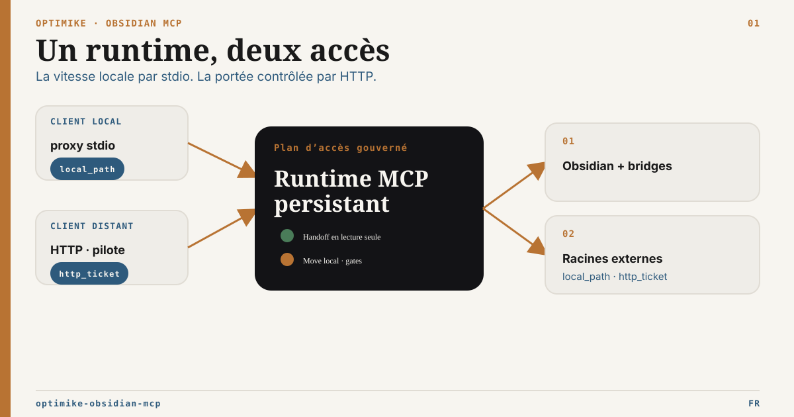

# Optimike Obsidian MCP

[](https://github.com/optimikelabs/optimike-obsidian-mcp/releases/latest)

English version: [README.md](README.md) · Hub documentaire : [docs/README.fr.md](docs/README.fr.md)
Exploitation : [OPERATIONS.fr.md](OPERATIONS.fr.md)
Sécurité : [SECURITY.fr.md](SECURITY.fr.md)



Optimike Obsidian MCP fournit aux clients MCP une surface opérationnelle
gouvernée au-dessus d’un coffre Obsidian. Il réunit opérations Desktop,
fonctionnement headless résilient, Tasks et Operon, Bases, recherche
sémantique, observabilité runtime et accès explicitement gouverné à des
documents autorisés hors du coffre.

## Carte des capacités

| Domaine                 | Ce que fournit le MCP                                                | Dépendance principale                                 |
| ----------------------- | -------------------------------------------------------------------- | ----------------------------------------------------- |
| Notes                   | Lecture, liste, recherche, mise à jour, frontmatter et tags          | Coffre ; Local REST API pour la surface live complète |
| Bases et Canvas         | Requêtes/écritures Bases, validation et helpers Canvas bornés        | Bases Bridge pour Bases en live                       |
| Tâches                  | Lecture/requête Tasks + 23 outils Operon gouvernés                   | Operon 3.2.1 Developer API V1 via le Bridge           |
| Recherche sémantique    | Recherche Smart Connections avec cache de métadonnées durable        | `.smart-env` + embedding Ollama ou OpenAI             |
| Runtime                 | Cache SQLite partagé, santé, maintenance, mode dégradé et exclusions | Filesystem local                                      |
| Documents externes      | Lectures/handoff gouvernés + move local opt-in avec réparation       | Allowlist ; stdio local pour le move                  |
| Administration headless | Opérations bornées sur notes, métadonnées et filesystem du coffre    | Mode guarded/filesystem sur un coffre copié           |

Le registre actuel des outils vit dans
[Surface des outils](docs/obsidian_mcp_tools_spec.md). Leur disponibilité dépend
du mode runtime ; consulter la
[Matrice des capacités](docs/runtime-capability-matrix.fr.md) avant d’activer
des écritures.

## Choisir un profil

| Besoin                                   | Profil recommandé                              | Posture                     |
| ---------------------------------------- | ---------------------------------------------- | --------------------------- |
| Codex (vérifié) ou client stdio local    | `dist/stdio-proxy.js`                          | Profil local par défaut     |
| Automatisation Obsidian Desktop          | `live` ou `hybrid` via le proxy stdio          | Desktop de confiance        |
| CI, serveur ou copie synchronisée        | `headless-readonly`                            | Profil headless le plus sûr |
| Écritures bornées sur coffre copié/dédié | `headless-guarded`, puis `headless-filesystem` | Opt-in explicite            |
| HTTP direct sur la même machine          | HTTP loopback authentifié                      | Supporté avec limites       |
| HTTP distant                             | Reverse proxy TLS revu + réseau privé          | Pilote seulement            |

Le serveur Node ne doit jamais être exposé directement à Internet. Voir
[Sécurité](SECURITY.fr.md) et
[l’ADR de livraison HTTP](docs/adr/ADR-HTTP-External-Artifact-Delivery.md).

## Démarrage rapide depuis les sources

Pré-requis :

- Node.js `>=22.7.5` ;
- Obsidian Desktop seulement pour les fonctions Desktop live ;
- plugins propres aux capacités réellement utilisées.

```bash
git clone https://github.com/optimikelabs/optimike-obsidian-mcp.git
cd optimike-obsidian-mcp
npm install
npm run build
node dist/stdio-proxy.js
```

Avec le package, le binaire proxy explicite est
`optimike-obsidian-mcp-proxy`. Le binaire historique
`optimike-obsidian-mcp` démarre toujours directement le backend.

Configuration Codex minimale :

```toml
[mcp_servers.optimike-obsidian-mcp-stdio]
command = "node"
args = ["/chemin/vers/optimike-obsidian-mcp/dist/stdio-proxy.js"]

[mcp_servers.optimike-obsidian-mcp-stdio.env]
OBSIDIAN_VAULT = "/chemin/vers/coffre"
OBSIDIAN_RUNTIME_MODE = "live"
OBSIDIAN_BASE_URL = "http://127.0.0.1:27123"
OBSIDIAN_API_KEY = "<cle-local-rest-api>"
```

Conserver chemins réels, clés API et configuration des racines externes hors du
dépôt et hors des contenus distribuables du coffre.

## Intégrations Obsidian optionnelles

Activer seulement les surfaces utilisées :

- [Local REST API](https://github.com/coddingtonbear/obsidian-local-rest-api) :
  notes, métadonnées et tags en live ;
- **Bases Bridge (REST)** inclus : opérations `.base` en live ;
- **Optimike Atomic Write Bridge** inclus : compare-and-replace SHA-256 opt-in pour le pilote interne sur les notes ;
- **Smart Connections** : index sémantique `.smart-env` ;
- **Operon 3.2.1** et **Optimike Operon Bridge** inclus : tâches live
  gouvernées via la Developer API officielle V1 ;
- la compatibilité Kairélys reste disponible comme chemin legacy/rollback
  borné, mais n’est plus le moteur de production ;
- **Obsidian Tasks** : parsing et configuration Tasks canoniques.

L’apply Operon exige deux opt-ins :

```text
Réglage Optimike Operon Bridge : Allow task mutations
OPERON_MUTATIONS_ENABLED=true
```

Les snapshots Operon obsolètes restent toujours en lecture seule.

Le remplacement atomique des notes a son propre réglage, désactivé par défaut, et ne requiert pas le grant Developer API d’Operon.

Le MCP expose une surface agentique gouvernée, pas toutes les fonctions de la
CLI Operon. Les diagnostics natifs, la recherche/résolution, les relations et
contextes bornés ainsi que l’état du timer sont disponibles en lecture seule.
Les relations et la récurrence disposent aussi d’écritures dédiées via des
plans officiels scellés. Les agents passent par le MCP parce qu’il ajoute des
schémas bornés, le moindre privilège, le dry-run, le verrouillage de révision,
l’idempotence durable, la vérification postflight et la récupération du plan
exact. Un relais CLI générique contournerait ces garanties. Les commandes
destructives ou d’administration restent dans la CLI. Voir le
[contrat MCP Operon](docs/operon-mcp-contract.fr.md) et
l’[audit CLI / Developer API](docs/operon-cli-audit.fr.md).

Note de compatibilité : l’adaptateur cible Operon officiel `3.2.1` et le Bridge
`0.6.0` ; `3.2.0` reste explicitement compatible et porte le pilote live complet.
Le settlement des frontmatters de date et le consentement multi-fenêtres
ont été fusionnés upstream avant ces versions. L’exécution des filtres
sauvegardés est maintenant disponible via la Developer API task-workflow après
un grant exact, mais l’API officielle ne publie pas leur catalogue : il faut
fournir un `filterSetId` exact obtenu dans l’UI/configuration d’Operon ou par un
workflow opérateur. L’adoption reste indisponible dans l’API officielle. Operon
3.2.1 omet encore le renderer déclaratif des contrôles de grant Developer API ;
le correctif est suivi dans [#145](https://github.com/hasanyilmaz/operon/issues/145)
et [#146](https://github.com/hasanyilmaz/operon/pull/146).
Le MCP ne bascule jamais vers Markdown ou des API privées. Les renommages
implicites de File Tasks restent suivis dans
[#139](https://github.com/hasanyilmaz/operon/pull/139), et le cas particulier des
transitions sans portée `project-serial` reste suivi dans
[#99](https://github.com/hasanyilmaz/operon/issues/99) et
[#101](https://github.com/hasanyilmaz/operon/pull/101).

## Racines documentaires externes

Les racines externes sont désactivées par défaut. Leurs lectures et handoffs
ordinaires forment un courtier d’autorisation default-deny, pas un index
externe, un moteur de synchronisation ou une sauvegarde.

Le même outil `external_handoff` choisit une livraison adaptée au transport :

- le stdio local retourne un `local_path` vérifié et temporaire ;
- le HTTP direct authentifié peut retourner un `http_ticket` opt-in, lié à
  l’identité et à usage unique ;
- aucun mode de livraison ne divulgue le chemin source ni n’autorise une
  mutation.

Une seule mutation volontairement étroite existe hors du parcours de handoff :
le stdio local via `headless-filesystem`, sur un coffre copié ou dédié, peut
déplacer ou renommer un fichier régulier dans une même racine opt-in et réparer
les références ÉLYSIA exactes. Elle exige inventaire et plan durable, gates
d’écriture explicites, préconditions de hash/CAS, journal et rollback
compensatoire. Elle n’est pas exposée en HTTP direct et n’ajoute ni création,
ni remplacement, ni suppression, ni upload, ni synchronisation.

Le cœur MCP n’embarque pas de moteur PDF, Office ou OCR. Le client appelant
assure l’extraction binaire et vérifie taille et SHA-256.

Commencer par
[Racines externes — configuration et exploitation](docs/external-roots-setup.fr.md).

## Recherche sémantique

`smart_semantic_search` interroge un index Smart Connections local. L’embedding
de requête peut rester local via Ollama ou passer par OpenAI selon la
configuration. Avec OpenAI, l’outil devient donc open-world même si l’index du
coffre reste local.

Voir [Exploitation](OPERATIONS.fr.md) pour les providers et le cache.

## Validation

```bash
npm run build
npm run test:runtime
npm run check:operon
npm run test:external-roots
npm run test:docs
npm run test:package
npm run audit:production
```

Les suites runtime utilisent des coffres jetables et sont couvertes en CI
Linux/Windows. Pour un test proche de la production, placer la base de cache
partagée hors du vrai coffre synchronisé.

## Documentation

- Entrée par audience et besoin : [Hub documentaire](docs/README.fr.md)
- Runtime et maintenance : [OPERATIONS.fr.md](OPERATIONS.fr.md)
- Sécurité et frontière de déploiement : [SECURITY.fr.md](SECURITY.fr.md)
- Outils actuels : [Surface des outils](docs/obsidian_mcp_tools_spec.md)
- Modes runtime : [Matrice des capacités](docs/runtime-capability-matrix.fr.md)
- Routage agentique : [Guide de routage](docs/mcp-routing-guide.fr.md)
- Outils Operon et garanties : [Contrat MCP Operon](docs/operon-mcp-contract.fr.md)
- Surface Operon et routage CLI : [Audit CLI / Developer API](docs/operon-cli-audit.fr.md)
- Déploiement headless : [Profil serveur headless](docs/headless-server-profile.fr.md)
- Pilote Linux headless multi-client : [pilote et matrice des capacités](docs/headless-multiclient-pilot.fr.md)
- Intégration gateway OSS : [Compatibilité gateways](docs/gateway-compatibility.fr.md)
- Documents externes : [Configuration des racines](docs/external-roots-setup.fr.md)
- Décisions d’architecture : [Index des ADR](docs/adr/README.md)
- Profil public Tasks ÉLYSIA : [profiles/elysia-tasks/README.fr.md](profiles/elysia-tasks/README.fr.md)

## Crédits

Créé par **Optimike — Mickaël Ahouansou**.

## Licence

Voir [LICENSE](LICENSE).
