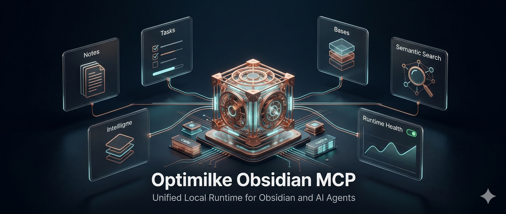

# Optimike Obsidian MCP

English version: [README.md](README.md)
Hub documentaire : [docs/README.fr.md](docs/README.fr.md)
Exploitation : [OPERATIONS.fr.md](OPERATIONS.fr.md)
Sécurité : [SECURITY.fr.md](SECURITY.fr.md)



Optimike Obsidian MCP fournit aux clients MCP une surface opérationnelle
gouvernée au-dessus d’un coffre Obsidian. Il réunit opérations Desktop,
fonctionnement headless résilient, Tasks et Operon, Bases, recherche
sémantique, observabilité runtime et accès explicite en lecture seule à des
documents autorisés hors du coffre.

## Carte des capacités

| Domaine                 | Ce que fournit le MCP                                                | Dépendance principale                                  |
| ----------------------- | -------------------------------------------------------------------- | ------------------------------------------------------ |
| Notes                   | Lecture, liste, recherche, mise à jour, frontmatter et tags          | Coffre ; Local REST API pour la surface live complète  |
| Bases et Canvas         | Requêtes/écritures Bases, validation et helpers Canvas bornés        | Bases Bridge pour Bases en live                        |
| Tâches                  | Lecture/requête Tasks + 13 outils Operon gouvernés                   | Tasks ; Kairélys/Operon Bridge pour les mutations live |
| Recherche sémantique    | Recherche Smart Connections avec cache de métadonnées durable        | `.smart-env` + embedding Ollama ou OpenAI              |
| Runtime                 | Cache SQLite partagé, santé, maintenance, mode dégradé et exclusions | Filesystem local                                       |
| Documents externes      | Racines logiques, liste/stat/hash/lecture et handoff vérifié         | Allowlist locale à la machine                          |
| Administration headless | Opérations bornées sur notes, métadonnées et fichiers                | Coffre copié ou dédié recommandé                       |

Le registre actuel des outils vit dans
[Surface des outils](docs/obsidian_mcp_tools_spec.md). Leur disponibilité dépend
du mode runtime ; consulter la
[Matrice des capacités](docs/runtime-capability-matrix.fr.md) avant d’activer
des écritures.

## Choisir un profil

| Besoin                                   | Profil recommandé                              | Posture                     |
| ---------------------------------------- | ---------------------------------------------- | --------------------------- |
| Codex ou autre client local              | `dist/stdio-proxy.js`                          | Profil local par défaut     |
| Automatisation Obsidian Desktop          | `live` ou `hybrid` via le proxy stdio          | Desktop de confiance        |
| CI, serveur ou copie synchronisée        | `headless-readonly`                            | Profil headless le plus sûr |
| Écritures bornées sur coffre copié/dédié | `headless-guarded`, puis `headless-filesystem` | Opt-in explicite            |
| HTTP direct sur la même machine          | HTTP loopback authentifié                      | Supporté avec limites       |
| HTTP distant                             | Reverse proxy TLS revu + réseau privé          | Pilote seulement            |

Le serveur Node ne doit jamais être exposé directement à Internet. Voir
[Sécurité](SECURITY.fr.md) et
[l’ADR de livraison HTTP](docs/adr/ADR-HTTP-External-Artifact-Delivery.md).

## Démarrage rapide depuis les sources

Pré-requis :

- Node.js `>=22.7.5` ;
- Obsidian Desktop seulement pour les fonctions Desktop live ;
- plugins propres aux capacités réellement utilisées.

```bash
git clone https://github.com/optimikelabs/optimike-obsidian-mcp.git
cd optimike-obsidian-mcp
npm install
npm run build
node dist/stdio-proxy.js
```

Avec le package, le binaire proxy explicite est
`optimike-obsidian-mcp-proxy`. Le binaire historique
`optimike-obsidian-mcp` démarre toujours directement le backend.

Configuration Codex minimale :

```toml
[mcp_servers.optimike-obsidian-mcp-stdio]
command = "node"
args = ["/chemin/vers/optimike-obsidian-mcp/dist/stdio-proxy.js"]

[mcp_servers.optimike-obsidian-mcp-stdio.env]
OBSIDIAN_VAULT = "/chemin/vers/coffre"
OBSIDIAN_RUNTIME_MODE = "live"
OBSIDIAN_BASE_URL = "http://127.0.0.1:27123"
OBSIDIAN_API_KEY = "<cle-local-rest-api>"
```

Conserver chemins réels, clés API et configuration des racines externes hors du
dépôt et hors des contenus distribuables du coffre.

## Intégrations Obsidian optionnelles

Activer seulement les surfaces utilisées :

- [Local REST API](https://github.com/coddingtonbear/obsidian-local-rest-api) :
  notes, métadonnées et tags en live ;
- **Bases Bridge (REST)** inclus : opérations `.base` en live ;
- **Smart Connections** : index sémantique `.smart-env` ;
- **Kairélys 2.6.3+ / Operon compatible** et
  **Optimike Operon Bridge** inclus : tâches live gouvernées ;
- **Obsidian Tasks** : parsing et configuration Tasks canoniques.

L’apply Operon exige deux opt-ins :

```text
Réglage Optimike Operon Bridge : Allow task mutations
OPERON_MUTATIONS_ENABLED=true
```

Les snapshots Operon obsolètes restent toujours en lecture seule.

## Racines documentaires externes

Les racines externes sont désactivées par défaut. Elles forment un courtier
d’autorisation en lecture seule, pas un index externe, un moteur de
synchronisation ou une sauvegarde.

Le même outil `external_handoff` choisit une livraison adaptée au transport :

- le stdio local retourne un `local_path` vérifié et temporaire ;
- le HTTP direct authentifié peut retourner un `http_ticket` opt-in, lié à
  l’identité et à usage unique ;
- aucun mode ne divulgue le chemin source ni n’autorise de mutation externe.

Le cœur MCP n’embarque pas de moteur PDF, Office ou OCR. Le client appelant
assure l’extraction binaire et vérifie taille et SHA-256.

Commencer par
[Racines externes — configuration et exploitation](docs/external-roots-setup.fr.md).

## Recherche sémantique

`smart_semantic_search` interroge un index Smart Connections local. L’embedding
de requête peut rester local via Ollama ou passer par OpenAI selon la
configuration. Avec OpenAI, l’outil devient donc open-world même si l’index du
coffre reste local.

Voir [Exploitation](OPERATIONS.fr.md) pour les providers et le cache.

## Validation

```bash
npm run build
npm run test:runtime
npm run check:operon
npm run test:external-roots
npm run test:docs
npm run test:package
npm run audit:production
```

Les suites runtime utilisent des coffres jetables et sont couvertes en CI
Linux/Windows. Pour un test proche de la production, placer la base de cache
partagée hors du vrai coffre synchronisé.

## Documentation

- Entrée par audience et besoin : [Hub documentaire](docs/README.fr.md)
- Runtime et maintenance : [OPERATIONS.fr.md](OPERATIONS.fr.md)
- Sécurité et frontière de déploiement : [SECURITY.fr.md](SECURITY.fr.md)
- Outils actuels : [Surface des outils](docs/obsidian_mcp_tools_spec.md)
- Modes runtime : [Matrice des capacités](docs/runtime-capability-matrix.fr.md)
- Routage agentique : [Guide de routage](docs/mcp-routing-guide.fr.md)
- Déploiement headless : [Profil serveur headless](docs/headless-server-profile.fr.md)
- Pilote Linux headless multi-client : [pilote et matrice des capacités](docs/headless-multiclient-pilot.fr.md)
- Intégration gateway OSS : [Compatibilité gateways](docs/gateway-compatibility.fr.md)
- Documents externes : [Configuration des racines](docs/external-roots-setup.fr.md)
- Décisions d’architecture : [Index des ADR](docs/adr/README.md)
- Profil public Tasks ÉLYSIA : [profiles/elysia-tasks/README.fr.md](profiles/elysia-tasks/README.fr.md)

## Crédits

Créé par **Optimike — Mickaël Ahouansou**.

## Licence

Voir [LICENSE](LICENSE).
