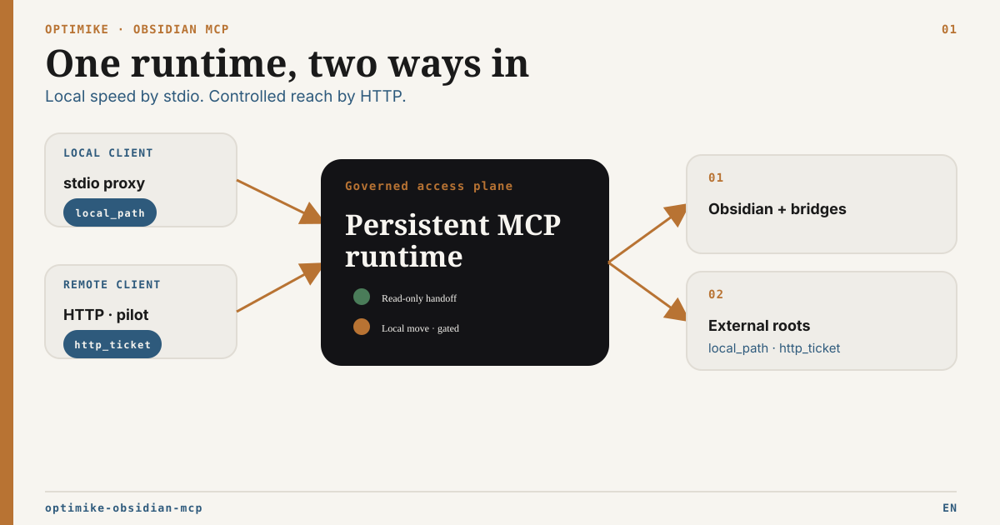

# Optimike Obsidian MCP

[](https://github.com/optimikelabs/optimike-obsidian-mcp/releases/latest)

French version: [README.fr.md](README.fr.md) · [Documentation hub](docs/README.md) · [Operations](OPERATIONS.md) · [Security](SECURITY.md)



Optimike Obsidian MCP gives MCP clients a governed operational surface over an Obsidian vault: live Desktop operations, resilient headless modes, Tasks and Operon, Bases and Canvas, semantic search, runtime observability, and bounded access to configured external documents.

## Capability map

| Area                    | What the MCP provides                                                  | Main dependency                                            |
| ----------------------- | ---------------------------------------------------------------------- | ---------------------------------------------------------- |
| Notes                   | Read/search/direct edits plus governed note and Frontmatter operations | Vault; Local REST API + Atomic Write Bridge                |
| Bases and Canvas        | Queries, bounded writes, governed formulas and Canvas graph plans      | Bases Bridge; Atomic Write Bridge                          |
| Tasks                   | Tasks-compatible Markdown plus 25 governed Operon tools                | Operon Developer API V1 through the Bridge                 |
| Semantic search         | Smart Connections index search                                         | `.smart-env` + Ollama or OpenAI-compatible query embedding |
| Runtime                 | Shared SQLite cache, health, maintenance and degraded modes            | Local filesystem                                           |
| External documents      | Default-deny reads/handoff plus opt-in local move                      | Explicit root allowlist                                    |
| Headless administration | Guarded metadata and filesystem operations                             | Copied or dedicated vault                                  |

The canonical tool registry is documented in [Tool Surface](docs/obsidian_mcp_tools_spec.md).

## Runtime and transport

| Need                                     | Recommended runtime / transport                          |
| ---------------------------------------- | -------------------------------------------------------- |
| Local agent                              | stdio proxy                                              |
| Obsidian Desktop automation              | `live` or `hybrid`                                       |
| CI/server/synchronized copy              | `headless-readonly`                                      |
| Bounded writes on copied/dedicated vault | `headless-guarded`, then `headless-filesystem`           |
| Same-machine HTTP                        | authenticated loopback HTTP                              |
| Remote HTTP                              | reviewed TLS reverse proxy + private network; pilot only |

Runtime answers what the backend can execute. It does not decide how many tools the model should see.

## Tool surface profiles

| Need                                              | Profile     | Full live/hybrid size |
| ------------------------------------------------- | ----------- | --------------------: |
| General vault work                                | `standard`  |                    22 |
| Notes, tags, Bases and Canvas authoring           | `authoring` |                    33 |
| Tasks / Operon workflows                          | `tasks`     |                    34 |
| Explicit complete, admin and specialized surfaces | `full`      |                    77 |

In 3.0, an unspecified profile defaults to `standard`. `smart_semantic_search` is the only registered semantic-search name; the former `smart_search` and `smart-search` aliases have been removed. `full` remains an explicit opt-in for the complete active-runtime surface. `bases_upsert_config` is a `full`-only whole-Base compatibility path; legacy whole-file config writes are default-off, while normal authoring uses bounded Base creation/row writes plus the governed formula family.

Select the profile before `tools/list`:

```bash
node dist/stdio-proxy.js --tool-profile standard
```

HTTP profile routes:

```text
/mcp/standard
/mcp/authoring
/mcp/tasks
/mcp/full
```

Unqualified `/mcp` now uses `standard`; `/mcp/full` remains the explicit complete route. See [Tool Surface Profiles](docs/tool-surface-profiles.md).

## Quick start

Requirements:

- Node.js `>=22.7.5`;
- Obsidian Desktop only for live features;
- capability-specific plugins listed below.

```bash
git clone https://github.com/optimikelabs/optimike-obsidian-mcp.git
cd optimike-obsidian-mcp
npm install
npm run build
node dist/stdio-proxy.js --tool-profile standard
```

Package binaries:

```text
optimike-obsidian-mcp
optimike-obsidian-mcp-proxy
```

Minimal Codex configuration:

```toml
[mcp_servers.optimike-obsidian-mcp-stdio]
command = "node"
args = [
  "/path/to/optimike-obsidian-mcp/dist/stdio-proxy.js",
  "--tool-profile",
  "standard"
]

[mcp_servers.optimike-obsidian-mcp-stdio.env]
OBSIDIAN_VAULT = "/path/to/vault"
OBSIDIAN_RUNTIME_MODE = "live"
OBSIDIAN_BASE_URL = "http://127.0.0.1:27123"
OBSIDIAN_API_KEY = "<local-rest-api-key>"
```

Keep real paths, API keys, journals and external-root configuration outside the repository and distributable vault content.

## Optional Obsidian integrations

Enable only the surfaces you use:

- [Local REST API](https://github.com/coddingtonbear/obsidian-local-rest-api) for live note, metadata and tag operations;
- bundled **Bases Bridge** for live Bases and governed formula CAS;
- bundled **Optimike Atomic Write Bridge** for governed Note replacement, body text patch, Frontmatter and Canvas `plan → apply → status → recover`;
- **Smart Connections** for the local semantic index;
- **Operon Developer API V1** and bundled **Optimike Operon Bridge 0.9.1** for governed task operations. Optimike MCP `3.7.0` targets official Operon `3.6.0`, Operon CLI `1.2.0`, and Local REST API `5.1.0`; release admission requires the repository's exact-SHA Pilot 2 gate. Operon `3.6.0` remains `compatible-provisional`: a non-denied release is writable only when contract negotiation, exact capabilities, schemas, health, index readiness and recovery support all validate; product version is not a positive write allowlist. The three bundled Bridges now [recover their Local REST routes after late startup or reload](docs/bridge-lifecycle.md) without restarting the MCP or changing write authorization. Their [single verified release bundle](docs/bridge-packaging.md) preserves plugin settings and supports fenced rollback.
- **Obsidian Tasks** for Tasks-compatible Markdown parsing.

Operon mutations require the Bridge mutation setting plus:

```text
OPERON_MUTATIONS_ENABLED=true
```

Stale Operon snapshots remain read-only. No Operon route falls back to raw Markdown or private APIs. Official adoption and Daily/Weekly routing negotiate their exact additive grant on first use, including after a cold MCP start; a pending or refused grant still fails closed. Operon owns every opaque sealed plan and same-plan recovery. Task Type and Task Image stay scalar, Task Gallery stays an ordered array, and `__taskDataType` is read-only. Full compatibility, certified/provisional versions, recovery semantics and current API gaps live in the [Operon MCP contract](docs/operon-mcp-contract.md) and [CLI / Developer API audit](docs/operon-cli-audit.md).

Operon `3.6.0` exposes the public periodic Task Workflow plan as metadata-only,
without a pre-apply task-source path. The exact-SHA release canary negotiates and
previews periodic operations but skips periodic applies with reason
`public_task_source_projection_unavailable`. This contains the destructive canary
without disabling runtime tools; upstream public path projection is a nonblocking
follow-up, and no full periodic certification is claimed. Core startup, adoption,
media, Frontmatter Date Manager, idempotence and restoration gates remain mandatory.

## Governed operations

Governed Note replacement, body text patch, Frontmatter, Base formula and Canvas families are exposed atomically:

```text
plan → apply → status → recover
```

After timeout or transport loss, call `status` before `recover`; never create a blind replacement mutation. Durable plans are not bound to the profile that created them.

If the client lost the opaque plan reference, call `obsidian_list_pending_operations`. The readonly cockpit lists only pending or uncertain governed Obsidian receipts from the live runtime's already-open journals, with the exact domain `planRef` and the next safe action. It never exposes targets, idempotency keys, content, hashes or backend bindings, and it never invokes status, apply or recovery. See [Pending Operation Cockpit](docs/operation-cockpit-p5.md).

## External document roots

External roots are disabled by default. They are an authorization broker, not an index, sync engine or backup system.

`external_handoff` is transport-aware:

- local stdio returns a verified short-lived `local_path`;
- authenticated direct HTTP may return an opt-in, identity-bound, single-use `http_ticket`;
- neither delivery mode authorizes mutation or reveals the physical source path.

`external_references_scan`, `external_move_plan` and `external_move_status` are
diagnostic only. `external_move_apply`, `external_move_rollback` and any
automatic mutating recovery are disabled on every platform until an audited
native handle-relative mutation primitive exists; the runtime reason is
`native_handle_relative_mutation_unavailable`. The contract still preserves
redacted receipts, private SQLite snapshots, legacy-binding and stale
session/binding checks, and exact-CAS evidence for a future implementation.

The MCP core does not embed PDF, Office or OCR engines. The caller owns binary extraction and verifies size and SHA-256.

See [External Roots Setup](docs/external-roots-setup.md).

## Semantic search

`smart_semantic_search` is the canonical semantic-search tool. It searches the local Smart Connections index. Query embedding can remain local through Ollama or use an OpenAI-compatible provider.

See [Operations](OPERATIONS.md) for providers and cache behavior.

## Verification

```bash
npm run build
npm run test:runtime
npm run test:governed-note-replace-mcp
npm run check:operon
npm run test:external-roots
npm run test:docs
npm run test:package
npm run audit:production
```

Runtime suites use disposable vaults and run in Linux/Windows CI.

## Documentation

- [Documentation hub](docs/README.md)
- [Tool Surface Profiles](docs/tool-surface-profiles.md)
- [Tool Surface](docs/obsidian_mcp_tools_spec.md)
- [Runtime Capability Matrix](docs/runtime-capability-matrix.md)
- [Runtime Capability Doctor](docs/capability-doctor.md)
- [Bridge Lifecycle Recovery](docs/bridge-lifecycle.md)
- [Bridge Bundle, Upgrade and Rollback](docs/bridge-packaging.md)
- [MCP Routing Guide](docs/mcp-routing-guide.md)
- [Operon MCP Contract](docs/operon-mcp-contract.md)
- [External Roots Setup](docs/external-roots-setup.md)
- [Headless Server Profile](docs/headless-server-profile.md)
- [Gateway Compatibility](docs/gateway-compatibility.md)
- [ADR Index](docs/adr/README.md)

## Credits

Created by **Optimike — Mickaël Ahouansou**.

## License

See [LICENSE](LICENSE).
