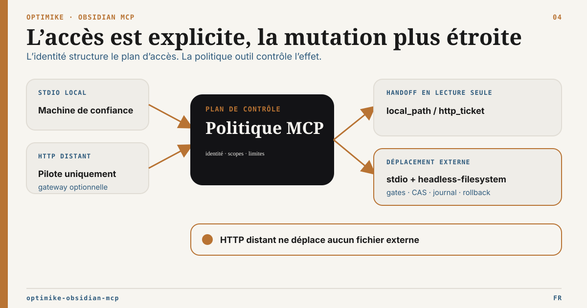

# Sécurité et frontière de déploiement

English version: [SECURITY.md](SECURITY.md)



Optimike Obsidian MCP peut lire et, dans des profils explicitement activés,
modifier une connaissance locale importante. Le processus, son environnement et
chaque client connecté appartiennent à une même frontière de sécurité.

## Postures supportées

| Profil                     | Statut                | Frontière minimale                                                        |
| -------------------------- | --------------------- | ------------------------------------------------------------------------- |
| Proxy stdio local          | Recommandé            | Utilisateur et machine locale de confiance                                |
| HTTP local sur `127.0.0.1` | Supporté avec limites | Identité JWT/OAuth réelle pour les outils protégés ; origins étroites     |
| HTTP distant               | Pilote seulement      | Reverse proxy TLS revu, réseau privé/firewall, auth réelle et supervision |
| Serveur Node public direct | Non supporté          | Ne pas déployer                                                           |

Lier le processus Node à `0.0.0.0` n’en fait pas un service public sécurisé. Le
serveur ne fournit ni terminaison TLS ni frontière complète pour Internet.

## Secrets et configuration locale

- Conserver `OBSIDIAN_API_KEY`, `OPENAI_API_KEY`, secrets JWT et identifiants
  OAuth dans l’environnement du processus ou un coffre de secrets.
- Ne jamais committer le vrai `MCP_EXTERNAL_ROOTS_FILE` ni les chemins machine.
- Ne pas placer identifiants ou racines personnelles dans les notes
  distribuables, logs ou rapports de bug.
- Faire tourner tout identifiant accidentellement divulgué.

## Authentification HTTP

Un profil HTTP protégé doit explicitement définir :

```text
MCP_AUTH_MODE=jwt
MCP_AUTH_SECRET_KEY=<secret-fort-de-32-caracteres-minimum>
MCP_ALLOWED_ORIGINS=<origins-explicites>
```

OAuth est supporté par le transport, mais un déploiement OAuth distant reste
pilote tant que métadonnées provider et interopérabilité client ne sont pas
validées.

Toute opération external-root en HTTP direct exige `external:read`. Le handoff
binaire HTTP exige aussi :

```text
MCP_HTTP_HANDOFF_ENABLED=true
```

Le broker refuse le placeholder d’authentification de développement. Les
tickets sont liés à l’identité, éphémères, à usage unique et absents des URL.
Ils n’autorisent aucune création, modification, suppression ou synchronisation.
Le HTTP direct refuse aussi `external_references_scan` et toutes les opérations
`external_move_*`.

L’entrée HTTP fournie dans `mcp.json` est volontairement un profil de
développement Inspector non authentifié, limité au loopback et avec handoff HTTP
désactivé. Ce n’est pas une configuration de production.

Voir [Configuration des racines](docs/external-roots-setup.fr.md) et
[ADR HTTP](docs/adr/ADR-HTTP-External-Artifact-Delivery.md). La frontière du
move local est définie dans
[l’ADR Intégrité des références externes](docs/adr/ADR-External-Reference-Integrity.fr.md).

## Frontière reverse proxy

Définir `MCP_TRUST_PROXY=true` seulement si :

- un reverse proxy revu écrase les headers de forwarding ;
- la politique réseau bloque l’accès direct au processus Node ;
- TLS, limites de connexion/corps et supervision sont en place.

Le booléen n’authentifie pas le proxy. Les headers de forwarding sont ignorés
par défaut.

## Sécurité des écritures

- Commencer les profils serveur et CI en `headless-readonly`.
- Tester `headless-guarded` et `headless-filesystem` sur un coffre copié ou
  dédié.
- Conserver `MCP_WRITE_MODE=readonly` tant que les écritures voulues ne sont pas
  comprises.
- Le remplacement gouverné d’une note complète n’est exposé qu’avec un service
  Obsidian REST live partagé. Le planning est refusé en `readonly` ; apply et
  recover revalident la politique d’écriture courante avant tout effet possible.
- Le frontmatter protégé est parsé structurellement et comparé depuis la même
  lecture Bridge qui scelle le hash initial. Un remplacement de fichier complet
  ne peut pas contourner `MCP_PROTECTED_FRONTMATTER_KEYS`.
- L’Atomic Write Bridge reste désactivé par défaut et impose chemin cible,
  binding backend et CAS SHA-256 via `Vault.process`. Après une réponse perdue,
  appeler `status`, jamais une nouvelle mutation aveugle ; `recover` reprend
  uniquement le plan exact scellé et n’est pas un undo.
- `MCP_OBSIDIAN_NOTE_REPLACE_JOURNAL_PATH` contient le contenu scellé des plans
  non terminaux. Le conserver local à la machine, à accès restreint, hors du
  coffre, des dépôts, dossiers synchronisés, artefacts publiés et diagnostics
  publics.
- L’atomicité couvre uniquement la transition contrôlée de la note cible. Sync,
  watchers, plugins tiers, indexeurs et automatisations externes ne sont pas
  annulés par la récupération du plan.
- L’apply Operon exige le réglage Bridge et
  `OPERON_MUTATIONS_ENABLED=true`.
- Utiliser dry-run, révisions/hashes attendus et preuve après écriture.
- Les racines externes sont read-only par défaut. L’unique mutation est un move
  stdio local d’un fichier régulier dans la même racine, avec réparation exacte
  des références ÉLYSIA.
- Apply et rollback exigent `MCP_WRITE_MODE=full`,
  `MCP_EXTERNAL_MOVE_ENABLED=true` et une racine portant la capacité `move`.
- La cible doit être absente sous un dossier parent réel existant. La séquence
  hard-link/unlink sans écrasement échoue fermée sur un filesystem non supporté
  ou cross-volume.
- Toute référence ambiguë, historique, legacy ou non supportée bloque l’apply.
  Les réparations par hash exact sont limitées à `headless-filesystem` sur une
  copie ou un coffre dédié. L’apply live échoue fermé, car les remplacements de
  note complète via Local REST n’imposent pas `If-Match`.
- `MCP_EXTERNAL_MOVE_JOURNAL_PATH` contient l’état durable des plans et les
  préimages de notes. Le conserver local à la machine, à accès restreint, hors
  dépôts, dossiers synchronisés et diagnostics publics.
- Aucun upload, create, replace, move de dossier/cross-root, overwrite, delete,
  corbeille ou sync externe n’est activé.

## Frontière Frontmatter gouvernée

P1 ne modifie que les plages source top-level explicitement autorisées. Tout
YAML non supporté ou commentaire d’appartenance ambiguë échoue fermé. Le cache
ne devient jamais une autorité d’admission, de CAS, de commit ou de recovery. P1
réutilise le journal et le fencing P0 ; aucun observateur ne peut emprunter
l’autorité d’un exécuteur et aucun second moteur de récupération n’est créé.

La projection durable conserve hashes et plages, jamais les valeurs patchées ni
le Markdown compilé. Les clés protégées et le write mode courant sont contrôlés
au planning puis avant chaque effet P0 possible.

## Contrôles dépendances et release

```bash
npm run audit:production
npm audit signatures
npm run build
npm run test:runtime
npm run test:external-roots
npm run test:docs
```

## Signaler une vulnérabilité

Utiliser le signalement privé de vulnérabilité ou les Security Advisories
GitHub quand ils sont disponibles. Ne jamais inclure identifiants actifs,
chemins privés, documents client ou payloads d’exploitation dans une issue
publique.
