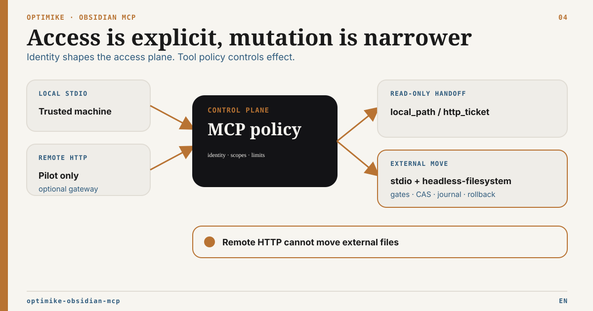

# Security and deployment boundary

French version: [SECURITY.fr.md](SECURITY.fr.md)



Optimike Obsidian MCP can read and, in explicitly enabled profiles, mutate
valuable local knowledge. Treat the process, its environment and every connected
client as part of one security boundary.

## Supported postures

| Profile                   | Status                | Minimum boundary                                                                         |
| ------------------------- | --------------------- | ---------------------------------------------------------------------------------------- |
| Local stdio proxy         | Recommended           | Trusted local user and machine                                                           |
| Local HTTP on `127.0.0.1` | Supported with limits | Real JWT/OAuth identity for protected tools; narrow origins                              |
| Remote HTTP               | Pilot only            | Reviewed TLS reverse proxy, private-network/firewall controls, real auth and supervision |
| Direct public Node server | Unsupported           | Do not deploy                                                                            |

Binding the Node process to `0.0.0.0` does not turn it into a secure public
service. The server does not provide TLS termination or a complete
internet-facing deployment boundary.

## Secrets and local configuration

- Keep `OBSIDIAN_API_KEY`, `OPENAI_API_KEY`, JWT secrets and OAuth credentials in
  the process environment or an operator secret store.
- Never commit the real `MCP_EXTERNAL_ROOTS_FILE` or machine paths.
- Do not put credentials or personal filesystem roots in vault notes,
  distributable profiles, logs or bug reports.
- Rotate a credential after accidental disclosure; deleting it from the latest
  commit is not sufficient.

## HTTP authentication

Protected HTTP profiles must explicitly set:

```text
MCP_AUTH_MODE=jwt
MCP_AUTH_SECRET_KEY=<strong-secret-at-least-32-characters>
MCP_ALLOWED_ORIGINS=<explicit-origins>
```

OAuth is supported by the transport, but remote OAuth deployment remains pilot
evidence until provider metadata and client interoperability are validated.

Every direct HTTP external-root operation requires `external:read`. HTTP binary
handoff additionally requires:

```text
MCP_HTTP_HANDOFF_ENABLED=true
```

The handoff broker rejects the development authentication placeholder. Tickets
are identity-bound, short-lived, single-use and absent from URLs. They do not
authorize upload, create, replace, move, delete or sync. Direct HTTP also
refuses `external_references_scan` and every `external_move_*` operation.

The bundled `mcp.json` HTTP entry is intentionally an unauthenticated,
loopback-only Inspector development profile with HTTP handoff disabled. It is
not a production configuration.

See [External Roots Setup](docs/external-roots-setup.md) for the full
configuration and [HTTP Delivery ADR](docs/adr/ADR-HTTP-External-Artifact-Delivery.md)
for the transport threat model. The local move boundary is specified by the
[External Reference Integrity ADR](docs/adr/ADR-External-Reference-Integrity.md).

## Reverse proxy boundary

Set `MCP_TRUST_PROXY=true` only when:

- a reviewed reverse proxy overwrites forwarding headers;
- network policy blocks direct access to the Node process;
- TLS, connection/body limits and process supervision are in place.

The boolean flag does not authenticate a proxy. Forwarding headers are ignored
by default.

## Write safety

- Start server and CI deployments in `headless-readonly`.
- Test `headless-guarded` and `headless-filesystem` on a copied or dedicated
  vault before production use.
- Keep `MCP_WRITE_MODE=readonly` unless the intended writes are understood.
- Operon apply requires both the Bridge mutation setting and
  `OPERON_MUTATIONS_ENABLED=true`.
- Use dry-run, expected revisions/hashes and post-write proof where supported.
- External roots are read-only by default. The only external mutation is a
  local-stdio same-root regular-file move with exact ÉLYSIA reference repair.
- External move apply and rollback require `MCP_WRITE_MODE=full`,
  `MCP_EXTERNAL_MOVE_ENABLED=true` and a root carrying the `move` capability.
- The target must be absent under an existing real parent. The no-clobber
  hard-link/unlink sequence fails closed on unsupported or cross-volume
  filesystems.
- Any ambiguous, historical, legacy or unsupported reference blocks apply.
  Exact-hash repairs are limited to `headless-filesystem` on a copied or
  dedicated vault. Live apply fails closed because whole-note Local REST writes
  do not enforce `If-Match`.
- `MCP_EXTERNAL_MOVE_JOURNAL_PATH` contains durable plan state and note
  preimages. Keep it machine-local, access-restricted and outside repositories,
  synchronized folders and public diagnostics.
- No external upload, create, replace, directory/cross-root move, overwrite,
  delete, trash or sync capability is enabled.

## Dependency and release checks

Run:

```bash
npm run audit:production
npm audit signatures
npm run build
npm run test:runtime
npm run test:external-roots
npm run test:docs
```

## Reporting a vulnerability

Use GitHub’s private vulnerability-reporting or security-advisory flow when it
is available for this repository. Do not include live credentials, private
paths, customer documents or exploit payloads in a public issue.
