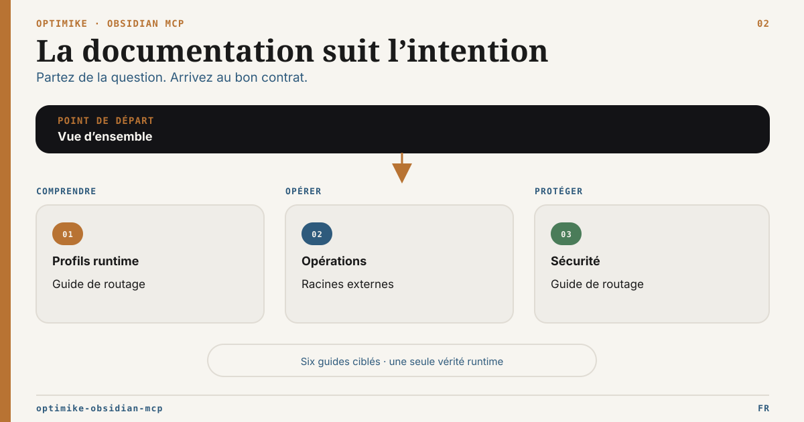

# Hub documentaire

English version: [README.md](README.md)

Cette page route chaque lecteur vers un document faisant autorité pour sa
question.

## Commencer selon son rôle

| Je suis…                        | Commencer ici                                             | Puis utiliser                                                                                                                                           |
| ------------------------------- | --------------------------------------------------------- | ------------------------------------------------------------------------------------------------------------------------------------------------------- |
| Nouvel utilisateur local        | [Présentation](../README.fr.md)                           | [Profils d’outils](tool-surface-profiles.fr.md), [Exploitation](../OPERATIONS.fr.md)                                                                    |
| Opérateur Codex ou agent local  | [Profils d’outils](tool-surface-profiles.fr.md)           | [Exploitation](../OPERATIONS.fr.md), [Routage agentique](mcp-routing-guide.fr.md)                                                                       |
| Opérateur headless/serveur      | [Profil serveur headless](headless-server-profile.fr.md)  | [Matrice runtime](runtime-capability-matrix.fr.md), [Profils d’outils](tool-surface-profiles.fr.md), [Sécurité](../SECURITY.fr.md)                      |
| Intégrateur d’une gateway       | [Compatibilité gateways OSS](gateway-compatibility.fr.md) | [Sécurité HTTP](http-multiclient-security.fr.md), [Backpressure](http-concurrency-backpressure.fr.md)                                                   |
| Intégrateur d’un client MCP     | [Profils d’outils](tool-surface-profiles.fr.md)           | [Surface des outils](obsidian_mcp_tools_spec.md), [Matrice runtime](runtime-capability-matrix.fr.md)                                                    |
| Opérateur de documents externes | [Configuration des racines](external-roots-setup.fr.md)   | [ADR racines externes](adr/ADR-External-Document-Roots.md), [ADR intégrité des références](adr/ADR-External-Reference-Integrity.fr.md)                  |
| Opérateur Tasks/Operon          | [Contrat MCP Operon](operon-mcp-contract.fr.md)           | [Audit CLI/API](operon-cli-audit.fr.md), [Validation locale](operon-local-validation.md), [profil public ÉLYSIA](../profiles/elysia-tasks/README.fr.md) |
| Contributeur ou relecteur       | [Décisions d’architecture](adr/README.md)                 | [Arbre du dépôt](tree.md), README des plugins                                                                                                           |

## Trouver la page qui fait foi

| Question                                                                      | Autorité                                                                                |
| ----------------------------------------------------------------------------- | --------------------------------------------------------------------------------------- |
| Quel profil serveur d’outils faut-il exposer à un client ?                    | [Profils de surface d’outils](tool-surface-profiles.fr.md)                              |
| Quels outils existent ?                                                       | [Surface des outils](obsidian_mcp_tools_spec.md)                                        |
| Quels outils sont disponibles dans chaque runtime ?                           | [Matrice des capacités](runtime-capability-matrix.fr.md)                                |
| Comment lancer et maintenir le service ?                                      | [Exploitation](../OPERATIONS.fr.md)                                                     |
| Comment les Bridges récupèrent-ils après un démarrage ou reload Local REST ?  | [Récupération du lifecycle](bridge-lifecycle.fr.md)                                     |
| Quel outil un agent doit-il choisir dans son profil ?                         | [Guide de routage](mcp-routing-guide.fr.md)                                             |
| Comment fonctionner sans Obsidian Desktop ?                                   | [Profil serveur headless](headless-server-profile.fr.md)                                |
| Comment fonctionnent lecture, handoff, move et réparation de liens externes ? | [Configuration des racines](external-roots-setup.fr.md)                                 |
| Quelle frontière de sécurité HTTP est supportée ?                             | [Sécurité](../SECURITY.fr.md) et [ADR HTTP](adr/ADR-HTTP-External-Artifact-Delivery.md) |
| Quel profil de gateway OSS a été prouvé de bout en bout ?                     | [Compatibilité gateways OSS](gateway-compatibility.fr.md)                               |
| Comment les lectures et mutations Operon sont-elles gouvernées ?              | [Contrat MCP Operon](operon-mcp-contract.fr.md)                                         |
| Comment fonctionne le remplacement atomique gouverné ?                        | [Contrat de remplacement gouverné](governed-note-replacement.fr.md)                     |
| Comment muter sûrement les formules nommées d’une Base Obsidian ?             | [Formules Base gouvernées P2](governed-base-formula-p2.fr.md)                           |
| Comment muter sûrement le graphe d’un JSON Canvas existant ?                  | [Canvas gouverné P3](governed-canvas-p3.fr.md)                                          |
| Pourquoi le MCP expose-t-il des fonctions Operon au lieu d’appeler la CLI ?   | [Audit CLI / Developer API](operon-cli-audit.fr.md)                                     |
| Pourquoi une décision d’architecture a-t-elle été prise ?                     | [Index des ADR](adr/README.md)                                                          |
| Qu’est-ce qui a changé ?                                                      | [Changelog](../CHANGELOG.md)                                                            |

Frontmatter gouvernée source-preserving : [contrat P1](governed-frontmatter-p1.fr.md).
Formules Base gouvernées source-preserving : [contrat P2](governed-base-formula-p2.fr.md).

## Familles de capacités

### Coffre et structures Obsidian

- notes, métadonnées et tags : [Surface des outils](obsidian_mcp_tools_spec.md#core-notes) ;
- Bases : [Surface des outils](obsidian_mcp_tools_spec.md#bases) ;
- Canvas et validation : [Surface des outils](obsidian_mcp_tools_spec.md#canvas-and-format-validation).

### Tâches et exécution

- lectures compatibles Tasks : [Surface des outils](obsidian_mcp_tools_spec.md#tasks) ;
- contrat Operon gouverné : [Contrat MCP Operon](operon-mcp-contract.fr.md) ;
- frontière MCP et CLI : [Audit CLI / Developer API](operon-cli-audit.fr.md) ;
- bridge Operon inclus : [README Operon Bridge](../plugins/obsidian-operon-bridge/README.md) ;
- bridge Bases inclus : [README Bases Bridge](../plugins/obsidian-bases-bridge/README.md) ;
- remplacement atomique gouverné : [contrat](governed-note-replacement.fr.md) et [README Atomic Write Bridge](../plugins/obsidian-atomic-write-bridge/README.md).

### Recherche et runtime

- profils publics d’exposition : [Profils de surface d’outils](tool-surface-profiles.fr.md) ;
- recherche sémantique et providers : [Exploitation](../OPERATIONS.fr.md) ;
- modes runtime : [Matrice des capacités](runtime-capability-matrix.fr.md) ;
- cache, santé et maintenance : [Exploitation](../OPERATIONS.fr.md).

### Documents externes

- configuration et parcours clients : [Configuration des racines](external-roots-setup.fr.md) ;
- routage agentique : [Guide de routage](mcp-routing-guide.fr.md#routage-documentaire-externe) ;
- frontière de livraison HTTP : [ADR HTTP](adr/ADR-HTTP-External-Artifact-Delivery.md) ;
- planification diagnostique du move local, preuves redacted et mutation différée :
  [ADR intégrité des références](adr/ADR-External-Reference-Integrity.fr.md).

## Propriété documentaire

- Les README présentent le produit et le premier démarrage réussi.
- Les Profils de surface d’outils portent `standard`, `authoring`, `tasks`, `full`, leur sélection et la sémantique d’exposition client.
- Les guides d’exploitation portent le runtime local et le dépannage.
- La surface des outils porte les noms et la sémantique des outils.
- La matrice runtime porte la disponibilité backend par mode.
- Le guide de routage porte la priorité canonique entre outils qui se chevauchent.
- Les guides de configuration portent les exemples.
- Les ADR portent décisions, statuts, frontières et options rejetées.
- Le changelog porte les versions et changements non publiés.

Ne pas recopier limites, variables d’environnement ou registres d’outils dans
plusieurs pages lorsqu’un lien vers l’autorité suffit.
