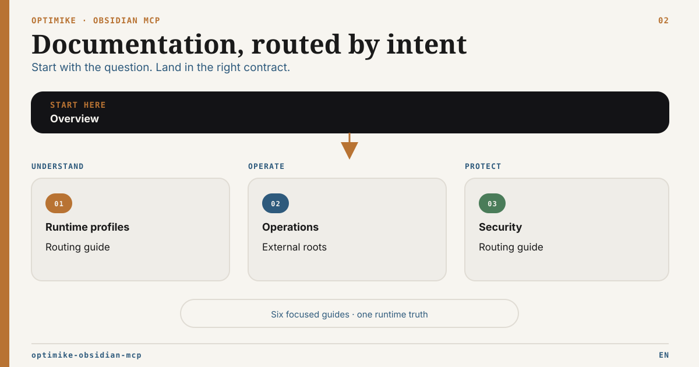

# Documentation hub

French version: [README.fr.md](README.fr.md)

This page routes readers to one authoritative document for each question.
French operator guides are linked alongside their English equivalents.

## Start by role

| I am…                           | Start here                                            | Then use                                                                                                                     |
| ------------------------------- | ----------------------------------------------------- | ---------------------------------------------------------------------------------------------------------------------------- |
| A new local user                | [Product overview](../README.md)                      | [Operations](../OPERATIONS.md)                                                                                               |
| A Codex or local-agent operator | [Operations](../OPERATIONS.md)                        | [Agent routing](mcp-routing-guide.md)                                                                                        |
| A headless/server operator      | [Headless Server Profile](headless-server-profile.md) | [Runtime Matrix](runtime-capability-matrix.md), [Security](../SECURITY.md)                                                   |
| A gateway integrator            | [OSS Gateway Compatibility](gateway-compatibility.md) | [HTTP Security](http-multiclient-security.md), [Backpressure](http-concurrency-backpressure.md)                              |
| An MCP client integrator        | [Tool Surface](obsidian_mcp_tools_spec.md)            | [Runtime Matrix](runtime-capability-matrix.md)                                                                               |
| An external-document operator   | [External Roots Setup](external-roots-setup.md)       | [External Roots ADR](adr/ADR-External-Document-Roots.md), [Reference Integrity ADR](adr/ADR-External-Reference-Integrity.md) |
| A Tasks/Operon operator         | [Operon MCP Contract](operon-mcp-contract.md)         | [CLI/API audit](operon-cli-audit.md), [Local Validation](operon-local-validation.md), [public ÉLYSIA profile](../profiles/elysia-tasks/README.fr.md) |
| A contributor or reviewer       | [Architecture decisions](adr/README.md)               | [Repository tree](tree.md), plugin READMEs                                                                                   |

## Find the authoritative page

| Question                                                   | Authority                                                                             |
| ---------------------------------------------------------- | ------------------------------------------------------------------------------------- |
| Which tools exist?                                         | [Tool Surface](obsidian_mcp_tools_spec.md)                                            |
| Which tools are available in each runtime?                 | [Runtime Capability Matrix](runtime-capability-matrix.md)                             |
| How do I run and maintain the service?                     | [Operations](../OPERATIONS.md)                                                        |
| Which surface should an agent use?                         | [MCP Routing Guide](mcp-routing-guide.md)                                             |
| How do I run without Obsidian Desktop?                     | [Headless Server Profile](headless-server-profile.md)                                 |
| How do external reads, handoff, move and link repair work? | [External Roots Setup](external-roots-setup.md)                                       |
| What is the supported HTTP security boundary?              | [Security](../SECURITY.md) and [HTTP ADR](adr/ADR-HTTP-External-Artifact-Delivery.md) |
| Which OSS gateway profile has been proven end to end?      | [OSS Gateway Compatibility](gateway-compatibility.md)                                 |
| How are Operon reads and mutations governed?               | [Operon MCP Contract](operon-mcp-contract.md)                                         |
| How does governed atomic note replacement work?            | [Governed Note Replacement](governed-note-replacement.md)                             |
| Why does MCP expose Operon functions instead of calling the CLI? | [Operon CLI / Developer API audit](operon-cli-audit.md)                           |
| Why was an architecture decision made?                     | [ADR Index](adr/README.md)                                                            |
| What changed?                                              | [Changelog](../CHANGELOG.md)                                                          |

## Capability families

### Vault and Obsidian structure

- notes, metadata and tags: [Tool Surface](obsidian_mcp_tools_spec.md#core-notes);
- Bases: [Tool Surface](obsidian_mcp_tools_spec.md#bases);
- Canvas and validation: [Tool Surface](obsidian_mcp_tools_spec.md#canvas-and-format-validation).

### Tasks and execution

- Tasks-compatible reads: [Tool Surface](obsidian_mcp_tools_spec.md#tasks);
- governed Operon contract: [Operon MCP Contract](operon-mcp-contract.md);
- MCP versus CLI boundary: [Operon CLI / Developer API audit](operon-cli-audit.md);
- bundled bridge implementation: [Operon Bridge README](../plugins/obsidian-operon-bridge/README.md);
- bundled Bases implementation: [Bases Bridge README](../plugins/obsidian-bases-bridge/README.md).
- governed atomic note replacement: [contract](governed-note-replacement.md) and [Atomic Write Bridge README](../plugins/obsidian-atomic-write-bridge/README.md).

### Search and runtime

- semantic search and providers: [Operations](../OPERATIONS.md#semantic-search-what-is-persisted-and-what-is-not);
- runtime modes: [Runtime Capability Matrix](runtime-capability-matrix.md);
- cache, health and maintenance: [Operations](../OPERATIONS.md).

### External documents

- configuration and client workflows: [External Roots Setup](external-roots-setup.md);
- semantic routing for agents: [MCP Routing Guide](mcp-routing-guide.md#external-document-routing);
- HTTP delivery boundary: [HTTP ADR](adr/ADR-HTTP-External-Artifact-Delivery.md);
- local move, exact link repair and rollback:
  [Reference Integrity ADR](adr/ADR-External-Reference-Integrity.md).

## Documentation ownership

- README files explain the product, profiles and first successful run.
- Operations guides own local runtime and troubleshooting.
- The tool surface owns tool names and semantics.
- The runtime matrix owns mode availability.
- Setup guides own configuration examples.
- ADRs own decisions, status, boundaries and rejected alternatives.
- The changelog records releases and unreleased changes.

Do not copy limits, environment-variable contracts or tool registries into
multiple pages when a link to the owning page is sufficient.
