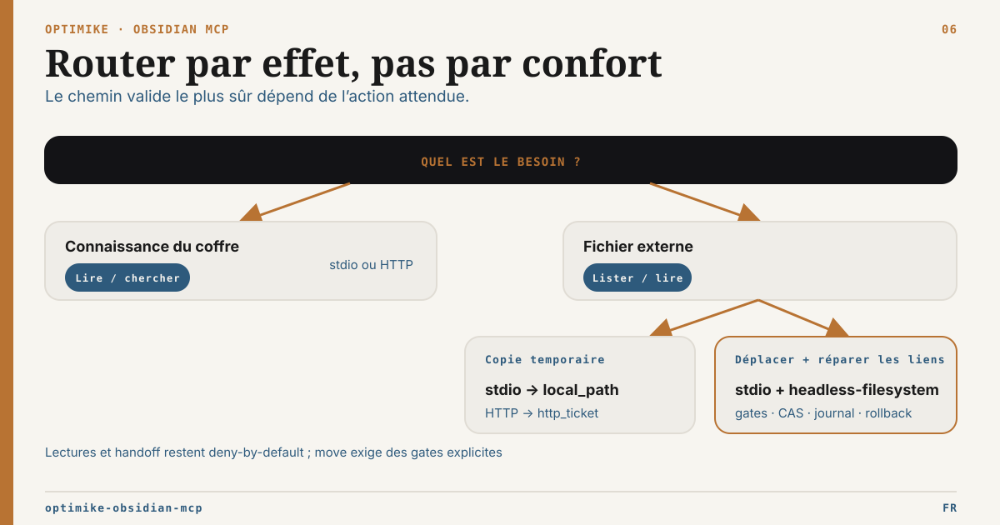

# Guide de routage MCP

Version anglaise : [mcp-routing-guide.md](mcp-routing-guide.md)

Docs liées : [README](../README.fr.md),
[Guide d’exploitation](../OPERATIONS.fr.md),
[Matrice des capacités runtime](runtime-capability-matrix.fr.md),
[Profil serveur headless](headless-server-profile.fr.md) et
[Racines documentaires externes](external-roots-setup.fr.md)

Ce guide aide les agents à choisir la bonne couche pour travailler avec Obsidian.

## Décision par défaut

| Besoin                                                                     | Utiliser                                                        | Pourquoi                                                                          |
| -------------------------------------------------------------------------- | --------------------------------------------------------------- | --------------------------------------------------------------------------------- |
| Lire, lister, rechercher, Tasks, recherche sémantique                      | Optimike MCP                                                    | Surface stable entre live, hybrid et headless.                                    |
| Lire un document explicitement configuré hors du coffre                    | Outils external-roots du MCP                                    | Confinement default-deny avec chemins logiques portables.                         |
| Déplacer un fichier externe sans casser silencieusement ses liens ÉLYSIA   | Workflow de move externe en stdio local                         | Inventaire, plan durable, réparations CAS exactes, reçu et rollback.              |
| Comportement Obsidian complet, commandes, active file, Bases via plugin    | Optimike MCP en `live` ou `hybrid` avec Obsidian Desktop ouvert | C'est le seul mode avec sémantique Desktop/plugin.                                |
| Serveur backend sûr au-dessus d'un vault synchronisé                       | Optimike MCP en `headless-readonly` d'abord                     | Pas besoin de Desktop et aucun risque d'écriture.                                 |
| Écritures Markdown/frontmatter/tags/admin bornées sur copie ou vault dédié | Optimike MCP en `headless-filesystem`                           | Sécurité de chemins, dry-run par défaut et préconditions.                         |
| Édition fichier directe ponctuelle hors contrat MCP                        | Outils filesystem                                               | Utile pour du travail local type repo, mais l'agent porte tous les garde-fous.    |
| Actions ou diagnostics app-native Obsidian                                 | Obsidian CLI                                                    | Utile comme plan de contrôle Desktop/app, pas comme headless strict.              |
| Savoir écrire la syntaxe Markdown, Bases ou Canvas Obsidian                | Skills ou docs de format Obsidian                               | Les skills enseignent les conventions ; elles n'exécutent pas les opérations MCP. |

## Nouveau en V2.2

Utiliser `obsidian_validate_format` avant les écritures risquées ou le contenu généré :

- `kind: markdown` vérifie frontmatter YAML, tags, wikilinks, embeds, callouts et code fences.
- `kind: base` vérifie YAML `.base`, views, références de formules et formes courantes.
- `kind: canvas` vérifie JSON Canvas, nodes, edges, IDs, géométrie et références d'edges.
- `kind: auto` infère depuis l'extension de `filePath`.

Utiliser `obsidian_manage_canvas` seulement en `headless-filesystem` :

- `validate` lit et valide un `.canvas` existant.
- `create` écrit un `.canvas` structurellement valide.
- `add_text_node` ajoute un nœud texte.
- `connect_nodes` ajoute une edge entre deux node IDs existants.

Le dry-run est le défaut pour les opérations d'écriture.

## Routage documentaire externe

Un lien Obsidian vers un fichier local n’autorise pas l’accès à ce fichier.
Employer les outils external-roots uniquement lorsque l’opérateur a
explicitement configuré un identifiant logique.

Workflow agent :

1. Appeler `external_runtime_status` ou `external_roots_list` ; ne jamais déduire
   une racine depuis un chemin physique trouvé dans une note.
2. Employer `external_list` et `external_stat` avec l’identifiant et un chemin
   relatif à la racine.
3. Employer `external_read` uniquement pour du texte UTF-8 borné.
4. Pour un PDF ou un document Office, demander explicitement
   `external_handoff` :
   - le stdio local retourne un `local_path` temporaire vérifié ;
   - le HTTP direct authentifié peut retourner un `http_ticket` opt-in, réclamé
     une seule fois via `GET /external-handoff` avec la même identité bearer et
     le header `X-External-Handoff-Ticket`.
5. Conserver comme provenance l’identifiant logique, le chemin relatif, la
   taille et le SHA-256. Ne jamais persister le chemin temporaire ni le ticket.

Pour un move gouverné par ÉLYSIA :

1. vérifier que le lien `file:///` cliquable possède l’identité canonique
   adjacente `external-ref:<rootId>::<chemin-relatif-encode-en-pourcentage>` ;
2. employer `external_references_scan`, puis `external_move_plan` ;
3. s’arrêter si `manualReview` n’est pas vide ; ne jamais réparer
   automatiquement une occurrence legacy ou ambiguë ;
4. examiner `external_move_status`, puis appeler `external_move_apply`
   uniquement avec les gates write locaux explicites et la même clé
   d’idempotence ;
5. vérifier le fichier cible et les notes réparées ; employer
   `external_move_rollback` seulement tant que ses préconditions persistées
   tiennent encore.

Cette transaction est réservée au stdio local. Elle accepte un fichier régulier,
une cible absente dans un dossier parent existant, et un move sans écrasement
dans la même racine et sur le même volume. Les éditions concurrentes de notes
sont protégées par une précondition SHA-256 exacte en `headless-filesystem` sur
une copie ou un coffre dédié. L’apply live via Local REST échoue fermé, car les
remplacements de note complète n’imposent pas encore `If-Match`. Ne pas router
create, replace, upload, delete, sync, dossier, cross-root ou cross-volume dans
ce workflow.

Toute opération external-root en HTTP direct exige `external:read`. Le HTTP
distant reste pilote derrière un proxy TLS et des contrôles réseau revus.
Le HTTP direct refuse scan de références, plan/status de move, apply et
rollback ; un ticket d’artefact autorise uniquement le téléchargement.

Ne pas promettre l’extraction au seul motif que le handoff fonctionne :
l’extraction dépend du client appelant. Ne pas copier silencieusement le contenu
externe dans le coffre, le fusionner à la recherche du coffre ou traiter la
racine configurée comme une sauvegarde.

## Ce que le headless valide mais ne garantit pas

La validation headless attrape les erreurs locales de format. Elle ne rend pas Obsidian, ne charge pas les plugins communautaires, n'évalue pas le comportement exact de l'UI Bases, n'exécute pas les formules, ne résout pas les backlinks via l'index interne Obsidian et ne confirme pas le layout visuel Canvas.

## Règle pratique pour agents

1. Valider le contenu généré avec `obsidian_validate_format`.
2. Si le comportement Desktop/plugin compte, utiliser `live` ou `hybrid` avec Obsidian ouvert.
3. Sur backend, commencer par `headless-readonly`.
4. Activer `headless-filesystem` seulement sur copie ou vault dédié avec rollback.
