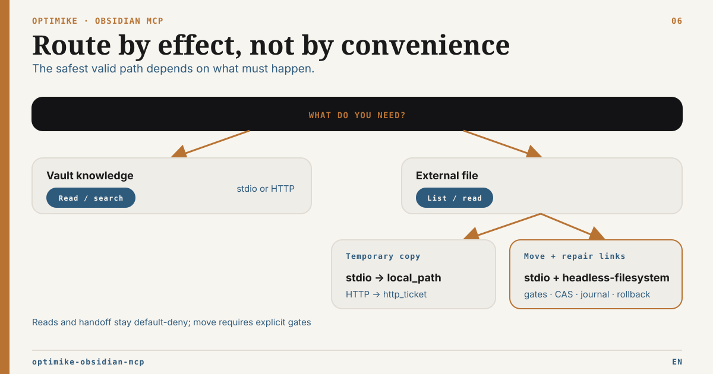

# MCP Routing Guide

French version: [mcp-routing-guide.fr.md](mcp-routing-guide.fr.md)

Related docs: [README](../README.md), [Tool Surface Profiles](tool-surface-profiles.md),
[Operations](../OPERATIONS.md), [Runtime Capability Matrix](runtime-capability-matrix.md),
[Headless Server Profile](headless-server-profile.md), and
[External document roots](external-roots-setup.md)

This guide helps agents choose the right layer and canonical tool for Obsidian work.

## Choose the exposure surface first

Runtime and tool profile are independent decisions:

- the runtime (`live`, `hybrid`, `headless-*`) defines what the backend can safely provide;
- the tool profile (`standard`, `authoring`, `tasks`, `full`) defines what the client sees before `tools/list`.

For new integrations, prefer `standard` for general vault work, `authoring` for
Bases/Canvas/tag authoring, and `tasks` for Operon workflows. `full` is the
explicit complete/admin surface. See [Tool Surface Profiles](tool-surface-profiles.md).

## Default Decision

| Need                                                                         | Use                                                           | Why                                                                     |
| ---------------------------------------------------------------------------- | ------------------------------------------------------------- | ----------------------------------------------------------------------- |
| Read, list, search, semantic search                                          | `standard` profile                                            | Small general-purpose surface with canonical search/write routing.      |
| Operon or Markdown Tasks workflows                                           | `tasks` profile                                               | Complete Operon contract plus Tasks-compatible Markdown tools.          |
| Bases, tags or Canvas authoring                                              | `authoring` profile                                           | Adds the authoring-specific surfaces without the full admin set.        |
| Read an explicitly configured document outside the vault                     | `full` + Optimike MCP external-root tools                     | External roots are specialized and default-deny.                        |
| Move one external file without silently breaking ÉLYSIA links                | `full` over local stdio on a copied or dedicated vault        | Inventory, durable plan, exact hash repairs, receipt and rollback.      |
| Full Obsidian behavior, commands, active file, plugin-backed Bases           | Optimike MCP in `live` or `hybrid` with Obsidian Desktop open | This is the only mode with Desktop/plugin-backed semantics.             |
| Safe backend server over a synced vault                                      | `headless-readonly` first                                     | No Desktop required and no write risk.                                  |
| Bounded Markdown/frontmatter/tag/admin writes on a copied or dedicated vault | `headless-filesystem`                                         | Path safety, dry-run defaults, and preconditions.                       |
| Direct one-off file edits outside the MCP contract                           | Filesystem tools                                              | Useful for local repo-style work, but the agent owns all safety checks. |
| App-native Obsidian actions or diagnostics                                   | Obsidian CLI                                                  | Useful as a Desktop/app control plane, not strict headless.             |
| Knowing how to write Obsidian Markdown, Bases, or Canvas syntax              | Obsidian-format skills or docs                                | Skills teach format conventions; they do not execute MCP operations.    |

## Local REST API 5.x targeting

For live writes, use Local REST API 5.0.2 or later within the supported 5.x
line, and choose an explicit vault-relative `filePath` whenever possible. Use
`activeFile` only when the currently open Desktop note is intentionally the
target. Targeted metadata PATCH requests use the Local REST API 5.x JSON
instruction contract; do not construct deprecated 1.x PATCH headers.

Do not route periodic notes through `/periodic/...`: those endpoints were
removed from the Local REST API core. Resolve the intended periodic note to an
explicit vault-relative path first, then use the ordinary note tools. The
optional upstream Periodic Notes API extension is a separate integration and is
not assumed by Optimike MCP.

## Direct, compatibility and governed tools

When multiple tools touch the same domain, they are not interchangeable. Use
this precedence:

| Intent                                            | Preferred tool                                                            | Direct or compatibility boundary                                                                                       |
| ------------------------------------------------- | ------------------------------------------------------------------------- | ---------------------------------------------------------------------------------------------------------------------- |
| Semantic similarity                               | `smart_semantic_search`                                                   | This is the only semantic-search name taught to new agents and exposed by modern profiles.                             |
| Operon-managed task reads                         | `operon_list_tasks`, `operon_query_tasks`                                 | `list_all_tasks` and `query_tasks` inspect Obsidian Tasks-compatible Markdown.                                         |
| Complete replacement of an existing Markdown note | `obsidian_note_replace_plan` then its matching apply/status/recover tools | `obsidian_update_note` overwrite has no durable receipt or exact-plan recovery.                                        |
| Top-level frontmatter set/delete                  | `obsidian_frontmatter_patch_plan` then its matching lifecycle             | `obsidian_manage_frontmatter` remains useful for reads, compatibility, or when the governed live projection is absent. |
| Named Base formula set/delete                     | `bases_formula_patch_plan` then its matching lifecycle                    | `bases_upsert_config` is a default-off whole-config compatibility path.                                                |
| Existing JSON Canvas graph mutation               | `obsidian_canvas_patch_plan` then its matching lifecycle                  | `obsidian_manage_canvas` is a direct headless-filesystem helper without durable recovery.                              |

Direct append, prepend, search/replace and tag mutations remain intentionally
available where the active runtime permits them. They do not produce a durable
plan/status/recovery receipt. Headless filesystem mutations are bounded fallback
operations for copied or dedicated vaults and do not claim Desktop/plugin
semantics.

The server exposes the same concise precedence as the MCP resource
`optimike://guides/tool-routing`. Clients can list and read that resource without
adding another callable mutation tool.

## Governed sequence

For every governed family:

1. Call the domain-specific `*_plan` tool once with a caller-owned idempotency key.
2. Inspect the returned receipt and retain its opaque `planRef`.
3. Call the matching `*_apply` tool with the same key.
4. After timeout or transport loss, call `*_status` first.
5. Call `*_recover` only when the receipt authorizes recovery of that exact plan.

A profile always exposes the full `plan → apply → status → recover` family or
none of it. The profile that created a plan is never recovery authority.

## Format validation

Use `obsidian_validate_format` before risky writes or generated content:

- `kind: markdown` checks frontmatter YAML, tags, wikilinks, embeds, callouts, and code fences.
- `kind: base` checks `.base` YAML, views, formula references, and common shape issues.
- `kind: canvas` checks JSON Canvas nodes, edges, IDs, node geometry, and edge references.
- `kind: auto` infers from `filePath` extension.

For an existing Canvas in live/hybrid mode, prefer
`obsidian_canvas_patch_plan → apply → status/recover`. The governed compiler
supports bounded text-node, geometry, node-deletion and edge intentions,
preserves unknown values, validates the final graph, and applies through the
separate Canvas CAS gate in Atomic Write Bridge 0.4.0.

Use `obsidian_manage_canvas` only as the direct `headless-filesystem` helper:

- `validate` reads and validates an existing `.canvas`.
- `create` writes a structurally valid `.canvas`.
- `add_text_node` appends a text node.
- `connect_nodes` adds an edge between existing node IDs.

Dry-run is the default for write operations.

## External document routing

An Obsidian link to a local file does not authorize access to that file. Use
external-root tools only when the operator has explicitly configured a logical
root ID and selected the specialized `full` surface.

Agent workflow:

1. Call `external_runtime_status` or `external_roots_list`; never infer a root
   from a physical path found in a note.
2. Use `external_list` and `external_stat` with a root ID and root-relative path.
3. Use `external_read` only for bounded UTF-8 text.
4. For PDF or Office content, request `external_handoff` explicitly:
   - local stdio returns a verified temporary `local_path`;
   - authenticated direct HTTP may return an opt-in `http_ticket`, which the
     client claims once from `GET /external-handoff` with the same bearer
     identity and `X-External-Handoff-Ticket` header.
5. Preserve the logical root ID, relative path, size and SHA-256 as provenance.
   Never persist a temporary path or ticket.

For an ÉLYSIA-managed move:

1. ensure the clickable `file:///` link has an adjacent canonical identity:
   `external-ref:<rootId>::<percent-encoded-relative-path>`;
2. use `external_references_scan`, then `external_move_plan`;
3. stop when `manualReview` is non-empty; never repair a historical or ambiguous occurrence automatically;
4. inspect `external_move_status`, then call `external_move_apply` only with
   explicit local write gates and the same idempotency key;
5. verify both the target file and repaired notes; use
   `external_move_rollback` only while its stored preconditions still hold.

This transaction is local stdio only. It supports one regular file, an absent
target in an existing parent, and a same-root/same-volume no-clobber move.
Concurrent note edits are protected by an exact SHA-256 precondition in
`headless-filesystem` on a copied or dedicated vault. Live Local REST apply
fails closed because whole-note writes do not currently enforce `If-Match`.
Do not route create, replace, upload, delete, sync, directory, cross-root or
cross-volume operations through this workflow.

Every direct HTTP external-root operation requires `external:read`. Remote HTTP
remains pilot-only behind reviewed TLS proxy and network controls. Direct HTTP
rejects external reference scan, move plan/status, apply and rollback; an
artifact ticket authorizes download only.

Do not promise extraction merely because handoff succeeds: extraction depends
on the calling client. Do not silently copy external content into the vault,
merge it into vault search, or treat the configured root as a backup.

## What Headless Can Validate But Not Guarantee

Headless validation catches local format errors. It does not render Obsidian,
load community plugins, evaluate exact Bases UI behavior, execute formulas,
resolve backlinks through Obsidian's internal index, or confirm visual Canvas
layout.

## Practical Rule For Agents

1. Select the narrowest server profile that contains the required domain.
2. Validate generated content with `obsidian_validate_format`.
3. If Desktop/plugin behavior matters, use `live` or `hybrid` with Obsidian open.
4. If running on a backend, start with `headless-readonly`.
5. Enable `headless-filesystem` only on a copied or dedicated vault with rollback.

There is intentionally no generic public `operation_*` surface.
