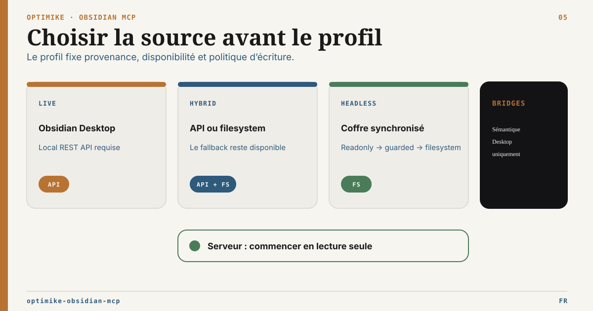

# Matrice des capacités runtime

Version anglaise : [runtime-capability-matrix.md](runtime-capability-matrix.md)

Docs liées : [README](../README.fr.md), [Guide d’exploitation](../OPERATIONS.fr.md), [Profil serveur headless](headless-server-profile.fr.md), [Guide de routage MCP](mcp-routing-guide.fr.md), [Configuration des racines externes](external-roots-setup.fr.md)

Optimike Obsidian MCP possède cinq contrats runtime. Les modes headless tournent au-dessus d’un vault Markdown synchronisé. Ils ne lancent pas Obsidian Desktop, ne chargent pas les plugins communautaires, n’exposent pas la palette de commandes et ne donnent pas l’état live de l’interface.

## Usage recommandé

| Mode runtime                 | Idéal pour                                             | Obsidian Desktop                       | Local REST API                                                | Écritures                                                                                                | Bases                                        | Posture par défaut        |
| ---------------------------- | ------------------------------------------------------ | -------------------------------------- | ------------------------------------------------------------- | -------------------------------------------------------------------------------------------------------- | -------------------------------------------- | ------------------------- |
| `live`                       | Automatisation Obsidian locale complète                | Requis                                 | Requis                                                        | Outils REST complets                                                                                     | Bases Bridge REST                            | Desktop de confiance      |
| `hybrid` avec API disponible | Workflows Desktop avec cache durable                   | Requis pendant l’usage des outils live | Optionnelle au démarrage, disponible pour la surface complète | Outils REST complets tant que l’API répond                                                               | Bases Bridge REST                            | Desktop robuste           |
| `hybrid` sans API            | Lecture/search dégradés quand Desktop est indisponible | Non requis                             | Indisponible                                                  | Aucun outil d’écriture                                                                                   | Non enregistré                               | Mode dégradé résilient    |
| `headless-readonly`          | Serveur, CI, Codex ou validation d’un vault Sync copié | Non requis                             | Non requis                                                    | Aucune                                                                                                   | Fallback local en lecture seule              | Mode headless le plus sûr |
| `headless-guarded`           | Écritures note très prudentes sur copie ou vault dédié | Non requis                             | Non requis                                                    | Append/prepend, search_replace, frontmatter set                                                          | Fallback local en lecture seule              | Palier write prudent      |
| `headless-filesystem`        | Fonctions filesystem headless explicites               | Non requis                             | Non requis                                                    | Écritures filesystem bornées, move/delete préconditionnés, index tags, batch frontmatter, helpers Canvas | Fallback local + écritures `.base` minimales | Sandbox/copie obligatoire |

## Tableau des capacités

| Capacité                               | `live`                    | `hybrid` API disponible                  | `hybrid` API indisponible | `headless-readonly`             | `headless-guarded`                  | `headless-filesystem`                                                      |
| -------------------------------------- | ------------------------- | ---------------------------------------- | ------------------------- | ------------------------------- | ----------------------------------- | -------------------------------------------------------------------------- |
| Démarrer sans `OBSIDIAN_API_KEY`       | Non                       | Oui                                      | Oui                       | Oui                             | Oui                                 | Oui                                                                        |
| Démarrer sans Obsidian Desktop         | Non                       | Oui                                      | Oui                       | Oui                             | Oui                                 | Oui                                                                        |
| Cache filesystem                       | Optionnel                 | Oui                                      | Oui                       | Requis                          | Requis                              | Requis                                                                     |
| Politique d’exclusion du vault         | Oui pour les scans cache  | Oui pour les scans cache                 | Oui                       | Oui                             | Oui                                 | Oui                                                                        |
| Lire/lister/rechercher                 | REST/cache                | REST/cache                               | Cache/filesystem          | Cache/filesystem                | Cache/filesystem                    | Cache/filesystem                                                           |
| Tasks list/query                       | Cache/filesystem          | Cache/filesystem                         | Cache/filesystem          | Cache/filesystem                | Cache/filesystem                    | Cache/filesystem                                                           |
| Recherche sémantique Smart Connections | `.smart-env` + embedder   | `.smart-env` + embedder compatible       | `.smart-env` + embedder   | `.smart-env` + embedder         | `.smart-env` + embedder             | `.smart-env` + embedder                                                    |
| Status/maintenance runtime             | Oui                       | Oui                                      | Oui                       | Oui                             | Oui                                 | Oui                                                                        |
| Racines documentaires externes         | Config locale optionnelle | Config locale optionnelle                | Config locale optionnelle | Config locale optionnelle       | Config locale optionnelle           | Config locale optionnelle                                                  |
| Scan/plan des références externes      | Stdio local               | Stdio local                              | Stdio local               | Stdio local                     | Stdio local                         | Stdio local                                                                |
| Apply/rollback de move externe         | Non                       | Non                                      | Non                       | Non                             | Non                                 | Stdio local + `full` + opt-ins move/racine                                 |
| Validation de format                   | Markdown/Base/Canvas      | Markdown/Base/Canvas                     | Markdown/Base/Canvas      | Markdown/Base/Canvas            | Markdown/Base/Canvas                | Markdown/Base/Canvas                                                       |
| Update note                            | Outil REST complet        | Outil REST complet                       | Non                       | Non                             | Append/prepend seulement            | Append/prepend seulement                                                   |
| Search/replace                         | Outil REST complet        | Outil REST complet                       | Non                       | Non                             | Remplacements exacts par `filePath` | Remplacements exacts par `filePath`                                        |
| Frontmatter                            | Outil REST complet        | Outil REST complet                       | Non                       | Non                             | `set` d’une clé unique              | `set`, batch frontmatter dry-run/apply, et rows Bases                      |
| Tags                                   | Outil REST complet        | Outil REST complet                       | Non                       | Non                             | Non                                 | Tags frontmatter, tags inline, index/audit local, rename avec dry-run      |
| Admin filesystem                       | Non                       | Non                                      | Non                       | Non                             | Non                                 | Archive, batch move, batch delete en dry-run par défaut                    |
| Suppression de note                    | Suppression REST          | Suppression REST                         | Non                       | Non                             | Non                                 | Suppression filesystem avec `expectedHash` ou `expectedMtime`              |
| Déplacement/renommage                  | Non                       | Non                                      | Non                       | Non                             | Non                                 | Déplacement filesystem avec `expectedHash` ou `expectedMtime`              |
| Active file / UI / commandes           | Via Desktop/plugin        | Via Desktop/plugin tant que l’API répond | Non                       | Non                             | Non                                 | Non                                                                        |
| Bases list/schema/query                | Bases Bridge REST         | Bases Bridge REST                        | Non                       | Fallback local en lecture seule | Fallback local en lecture seule     | Fallback local avec filtres simples (`eq`, `contains`, `in`, comparaisons) |
| Bases create/upsert                    | Bases Bridge REST         | Bases Bridge REST                        | Non                       | Non                             | Non                                 | `.base` YAML create/config + rows -> frontmatter `set`                     |
| JSON Canvas create/edit                | Non                       | Non                                      | Non                       | Non                             | Non                                 | `.canvas` minimal : create, text node, edge, validate                      |
| Parité plugins Obsidian                | Plugins Desktop           | Plugins Desktop tant que l’API répond    | Non                       | Non                             | Non                                 | Non                                                                        |

## Registre des tools par mode

Tous les modes enregistrent aussi `external_runtime_status`,
`external_roots_list`, `external_list`, `external_stat`, `external_read`,
`external_handoff`, `external_references_scan`, `external_move_plan`,
`external_move_status`, `external_move_apply` et `external_move_rollback`. Sans
`MCP_EXTERNAL_ROOTS_FILE`, le statut reste désactivé et les opérations échouent
fermées.

Le serveur HTTP direct enregistre les cinq noms d’intégrité uniquement pour
retourner un refus stdio-only explicite. Le proxy stdio local les implémente.
Scan, plan et status sont read-only. Apply et rollback exigent en plus
`MCP_WRITE_MODE=full`, `MCP_EXTERNAL_MOVE_ENABLED=true`, la capacité `move` de
la racine et un backend qui expose `obsidian_search_replace` conditionnel.

Tous les modes enregistrent aussi les 13 outils du contrat Operon :
`operon_status`, `operon_get_configuration`, `operon_list_tasks`,
`operon_get_task`, `operon_query_tasks`, `operon_query_saved_filter`,
`operon_validate`, `operon_adopt_task`, `operon_create_task`,
`operon_update_task`, `operon_transition_task`, `operon_convert_task` et
`operon_relocate_task`. Hors mode live, ils restent limités aux snapshots
validés en lecture seule ; toute mutation échoue fermée.

La livraison du handoff est un contrat de transport, pas une capacité d’écriture
du mode runtime :

- le stdio expose un `local_path` vérifié, géré par le cycle de vie local du
  handoff ;
- le HTTP direct peut exposer un `http_ticket` authentifié uniquement si
  `MCP_HTTP_HANDOFF_ENABLED=true` et si l’identité porte `external:read` ;
- toute opération HTTP directe de status, list, stat, read, hash ou handoff sur
  les racines externes exige `external:read` ;
- le ticket HTTP reste en lecture seule, expurgé de tout chemin physique, borné,
  à usage unique et désactivé par défaut ;
- aucun mode runtime ne gagne d’upload, create, replace, delete ou sync sur une
  racine externe grâce à ce profil de livraison ;
- le contrat de move stdio local séparé porte un fichier régulier dans la même
  racine, une cible absente, la réparation exacte des références ÉLYSIA et le
  rollback.

| Mode runtime                     | Tools enregistrées                                                                                                                                                                                                                                                                                                                                                  |
| -------------------------------- | ------------------------------------------------------------------------------------------------------------------------------------------------------------------------------------------------------------------------------------------------------------------------------------------------------------------------------------------------------------------- |
| `headless-readonly`              | `bases_get_schema`, `bases_list`, `bases_query`, `list_all_tasks`, `obsidian_global_search`, `obsidian_list_notes`, `obsidian_read_note`, `obsidian_runtime_maintenance`, `obsidian_runtime_status`, `obsidian_validate_format`, `query_tasks`, `smart-search`, `smart_search`, `smart_semantic_search`                                                             |
| `headless-guarded`               | Tout `headless-readonly`, plus `obsidian_manage_frontmatter`, `obsidian_search_replace`, `obsidian_update_note`                                                                                                                                                                                                                                                     |
| `headless-filesystem`            | Tout `headless-guarded`, plus `bases_create`, `bases_upsert_config`, `bases_upsert_rows`, `obsidian_admin_filesystem`, `obsidian_batch_frontmatter`, `obsidian_delete_note`, `obsidian_manage_canvas`, `obsidian_manage_tags`, `obsidian_move_note`                                                                                                                 |
| `hybrid` API indisponible        | `list_all_tasks`, `obsidian_global_search`, `obsidian_list_notes`, `obsidian_read_note`, `obsidian_runtime_maintenance`, `obsidian_runtime_status`, `obsidian_validate_format`, `query_tasks`, `smart-search`, `smart_search`, `smart_semantic_search`                                                                                                              |
| `hybrid` API disponible / `live` | Tools read/search/tasks/runtime/sémantique, `obsidian_validate_format`, plus outils REST d’écriture et Bases Bridge : `bases_create`, `bases_get_schema`, `bases_list`, `bases_query`, `bases_upsert_config`, `bases_upsert_rows`, `obsidian_delete_note`, `obsidian_manage_frontmatter`, `obsidian_manage_tags`, `obsidian_search_replace`, `obsidian_update_note` |

## Notes de sécurité

- `headless-readonly` est le premier mode sûr pour une vraie copie Sync.
- `headless-guarded` garde une surface write prudente et ne porte pas les opérations destructives.
- `headless-filesystem` doit être validé sur une copie ou un vault dédié avant tout chemin d’écriture production.
- Les écritures guarded utilisent des chemins relatifs au vault, rejettent les chemins absolus et les traversals, écrivent atomiquement et acceptent des préconditions `expectedHash` ou `expectedMtime`.
- Le move/delete filesystem headless requiert une précondition `expectedHash` ou `expectedMtime`.
- Les tags headless modifient le texte Markdown (`tags` frontmatter ou `#tags` inline) et peuvent produire un index local depuis le cache.
- Le rename global de tags reste une fonction filesystem : dry-run d’abord, puis apply seulement sur copie ou vault serveur dédié.
- `obsidian_admin_filesystem` sert aux opérations admin explicites ; il ne doit pas remplacer les outils de lecture/écriture courants.
- `obsidian_validate_format` est un validateur local. Il améliore la sûreté des sorties agent, mais ne rend pas Obsidian, ne charge pas les plugins et n’évalue pas la sémantique exacte de l’interface Bases.
- `obsidian_manage_canvas` reste volontairement minimal et filesystem-only : create, ajout de nœud texte, connexion de nœuds, validation.
- Le batch frontmatter headless démarre en dry-run et ne supporte que `set` ; les clés protégées restent bloquées par policy.
- Les écritures Bases headless écrivent des fichiers `.base` et des propriétés frontmatter ; elles n’évaluent pas les vues, formules ou propriétés calculées d’Obsidian.
- La politique d’exclusion protège les scans Optimike cache/search/tasks/Bases. Elle n’empêche pas Obsidian Sync de télécharger les fichiers.
- Un service HTTP local doit rester lié au loopback, valider les origines fournies, ignorer les headers de forwarding sans proxy de confiance et employer un port déterministe par défaut.
- Le `/healthz` public est limité à la vie du service et ne divulgue aucun chemin ; l’état détaillé du runtime et de l’intégrité reste derrière l’outil MCP authentifié.
- Un profil HTTP distant reste un pilote derrière des contrôles TLS, auth, proxy et réseau revus. L’exposition publique directe n’est pas supportée.
- Les tickets HTTP d’artefacts exigent une vraie identité authentifiée avec
  `external:read` et n’autorisent jamais une mutation de racine externe. Le HTTP
  direct refuse aussi scan de références, plan/status de move, apply et rollback.
- La réparation automatique exige le token adjacent exact
  `external-ref:<rootId>::<chemin-relatif-encode-en-pourcentage>`. Toute
  occurrence ambiguë, historique ou non supportée bloque l’apply.
- Le move externe emploie une séquence hard-link/unlink sans écrasement sur le
  même volume et des écritures de notes préconditionnées par hash exact en
  `headless-filesystem`, sur une copie ou un coffre dédié. L’apply live échoue
  fermé tant que Local REST ne fournit pas d’écriture atomique conditionnelle
  de note complète.
- Une validation d’écriture headless doit créer un nouveau brouillon dans un dossier sandbox. Elle ne doit pas modifier des notes existantes d’un vrai vault.
