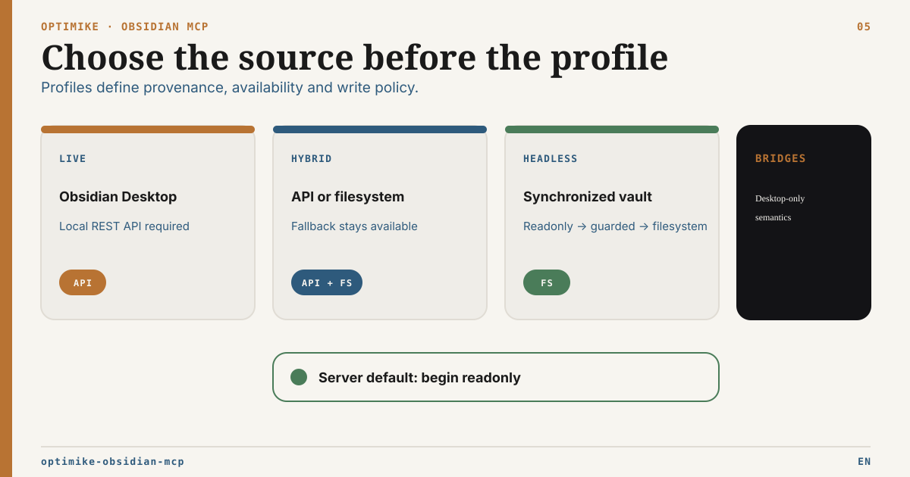

# Runtime Capability Matrix

French version: [runtime-capability-matrix.fr.md](runtime-capability-matrix.fr.md)

Related docs: [README](../README.md), [Operations](../OPERATIONS.md), [Governed note replacement](governed-note-replacement.md), [Governed Base Formula P2](governed-base-formula-p2.md), [Headless Server Profile](headless-server-profile.md), [MCP Routing Guide](mcp-routing-guide.md), [External Roots Setup](external-roots-setup.md)

Optimike Obsidian MCP has five runtime contracts. Headless modes run over a synchronized Markdown vault. They do not run Obsidian Desktop, load community plugins, expose the command palette, or provide live UI state.

In 3.1, `OBSIDIAN_STARTUP_BLOCKING` defaults to `false`. A live or hybrid MCP
process therefore stays up when Codex starts before Obsidian Desktop; live tools
remain temporarily unavailable and fail closed until Local REST becomes
reachable. Set the variable to `true` only when a live deployment must fail its
own startup after the bounded initial health-check retries.

The live REST adapter requires Local REST API 5.0.2 or later within the
supported 5.x line. Its targeted writes use the native JSON PATCH instruction
contract. Deprecated 1.x PATCH headers and the removed core `/periodic/...`
endpoints are not part of the supported runtime surface. Periodic notes must be
addressed by an explicit vault-relative `filePath`; the optional upstream
Periodic Notes API extension is outside the core MCP contract.

## Recommended Use

| Runtime mode                | Best for                                                 | Obsidian Desktop                   | Local REST API                             | Writes                                                                                                  | Bases                                   | Default posture         |
| --------------------------- | -------------------------------------------------------- | ---------------------------------- | ------------------------------------------ | ------------------------------------------------------------------------------------------------------- | --------------------------------------- | ----------------------- |
| `live`                      | Full local Obsidian automation                           | Required                           | >=5.0.2 in the supported 5.x line          | Full REST write tools                                                                                   | Bases Bridge REST                       | Trusted desktop         |
| `hybrid` with API available | Desktop workflows with cache durability                  | Required while live tools are used | Optional startup; >=5.0.2 for full surface | Full REST write tools while API is available                                                            | Bases Bridge REST                       | Robust desktop          |
| `hybrid` without API        | Degraded read/search while Desktop is down               | Not required                       | Unavailable                                | No write tools                                                                                          | Not registered                          | Resilient degraded mode |
| `headless-readonly`         | Server, CI, Codex, or copied Sync vault validation       | Not required                       | Not required                               | None                                                                                                    | Local readonly fallback                 | Safest headless mode    |
| `headless-guarded`          | Very cautious note writes on a copied or dedicated vault | Not required                       | Not required                               | Append/prepend, search_replace, frontmatter set                                                         | Local readonly fallback                 | Cautious write step     |
| `headless-filesystem`       | Explicit headless filesystem features                    | Not required                       | Not required                               | Bounded filesystem writes, move/delete with preconditions, tag index, batch frontmatter, Canvas helpers | Local fallback + minimal `.base` writes | Sandbox/copy required   |

## Capability Table

| Capability                         | `live`                  | `hybrid` API available                  | `hybrid` API unavailable | `headless-readonly`     | `headless-guarded`               | `headless-filesystem`                                                     |
| ---------------------------------- | ----------------------- | --------------------------------------- | ------------------------ | ----------------------- | -------------------------------- | ------------------------------------------------------------------------- |
| Start without `OBSIDIAN_API_KEY`   | No                      | Yes                                     | Yes                      | Yes                     | Yes                              | Yes                                                                       |
| Start without Obsidian Desktop     | Yes; live tools wait    | Yes                                     | Yes                      | Yes                     | Yes                              | Yes                                                                       |
| Filesystem cache                   | Optional                | Yes                                     | Yes                      | Required                | Required                         | Required                                                                  |
| Vault exclusion policy             | Yes for cache scans     | Yes                                     | Yes                      | Yes                     | Yes                              | Yes                                                                       |
| List/read/search                   | REST/cache              | REST/cache                              | Cache/filesystem         | Cache/filesystem        | Cache/filesystem                 | Cache/filesystem                                                          |
| Tasks list/query                   | Cache/filesystem        | Cache/filesystem                        | Cache/filesystem         | Cache/filesystem        | Cache/filesystem                 | Cache/filesystem                                                          |
| Smart semantic search              | `.smart-env` + embedder | `.smart-env` + compatible embedder      | `.smart-env` + embedder  | `.smart-env` + embedder | `.smart-env` + embedder          | `.smart-env` + embedder                                                   |
| Runtime status/maintenance         | Yes                     | Yes                                     | Yes                      | Yes                     | Yes                              | Yes                                                                       |
| Pending governed-operation cockpit | Yes                     | Yes                                     | No                       | No                      | No                               | No                                                                        |
| External document roots            | Optional local config   | Optional local config                   | Optional local config    | Optional local config   | Optional local config            | Optional local config                                                     |
| External reference scan/plan       | Local stdio             | Local stdio                             | Local stdio              | Local stdio             | Local stdio                      | Local stdio                                                               |
| External move apply/rollback       | No                      | No                                      | No                       | No                      | No                               | Disabled on every platform: `native_handle_relative_mutation_unavailable` |
| Format validation                  | Markdown/Base/Canvas    | Markdown/Base/Canvas                    | Markdown/Base/Canvas     | Markdown/Base/Canvas    | Markdown/Base/Canvas             | Markdown/Base/Canvas                                                      |
| Update note                        | REST full tool          | REST full tool                          | No                       | No                      | Append/prepend only              | Append/prepend only                                                       |
| Governed atomic note replacement   | Atomic Write Bridge CAS | Same while API and Bridge are available | No                       | No                      | No                               | No                                                                        |
| Governed Markdown body text patch  | Same Atomic Write CAS   | Same while API and Bridge are available | No                       | No                      | No                               | No                                                                        |
| Search/replace                     | REST full tool          | REST full tool                          | No                       | No                      | Exact filePath replacements only | Exact filePath replacements only                                          |
| Frontmatter                        | REST full tool          | REST full tool                          | No                       | No                      | Single-key `set` only            | `set`, batch frontmatter dry-run/apply, and Bases rows                    |
| Tags                               | REST full tool          | REST full tool                          | No                       | No                      | No                               | Frontmatter tags, inline tags, local index/audit, dry-run rename          |
| Admin filesystem                   | No                      | No                                      | No                       | No                      | No                               | Archive, batch move, batch delete; dry-run by default                     |
| Delete note                        | REST delete             | REST delete                             | No                       | No                      | No                               | Filesystem delete requiring `expectedHash` or `expectedMtime`             |
| Move/rename                        | No                      | No                                      | No                       | No                      | No                               | Filesystem move requiring `expectedHash` or `expectedMtime`               |
| Active file / UI / commands        | Via Desktop/plugin      | Via Desktop/plugins while API available | No                       | No                      | No                               | No                                                                        |
| Bases list/schema/query            | Bases Bridge REST       | Bases Bridge REST                       | No                       | Local readonly fallback | Local readonly fallback          | Local fallback with simple filters (`eq`, `contains`, `in`, comparisons)  |
| Bases create/upsert                | Bases Bridge REST       | Bases Bridge REST                       | No                       | No                      | No                               | `.base` YAML create/config + rows -> frontmatter `set`                    |
| JSON Canvas create/edit            | Governed graph CAS      | Same while API/Bridge are available     | No                       | No                      | No                               | Direct minimal `.canvas` create, text node, edge, validate                |
| Obsidian plugin parity             | Desktop plugins         | Desktop plugins while API available     | No                       | No                      | No                               | No                                                                        |

## Tool Registry By Mode

Every mode also registers `external_runtime_status`, `external_roots_list`,
`external_list`, `external_stat`, `external_read`, `external_handoff`,
`external_references_scan`, `external_move_plan`, `external_move_status`,
`external_move_apply`, and `external_move_rollback`.
Without `MCP_EXTERNAL_ROOTS_FILE`, status remains disabled and operations fail
closed.

The direct HTTP server registers the five reference-integrity names only to
return an explicit stdio-only denial. The local stdio proxy implements them.
Scan, plan and status are diagnostic/read-only. Apply, rollback and automatic
mutating recovery are disabled on every platform until an audited native
handle-relative mutation primitive exists. Runtime reports
`native_handle_relative_mutation_unavailable`; write-mode, feature and root
capability gates cannot override it. Redacted receipts, private SQLite
snapshots, legacy/stale session-binding checks and exact-CAS evidence remain
contractual.

`external_runtime_status.externalMove` separates the two closed capability
planes. Direct HTTP always reports `planningAvailable: false` with
`planningUnavailableReason: "stdio_only"`; verified local stdio may report
`planningAvailable: true`. In both transports `mutationAvailable: false` and
`mutationUnavailableReason: "native_handle_relative_mutation_unavailable"`
remain authoritative. If stdio cannot verify its local binding, it reports a
redacted planning reason (`profile_required`, `target_unverified`, or
`backend_attestation_unavailable`) without publishing a path or digest.

Every mode also registers the 25 Operon contract tools:
`operon_status`, `operon_get_configuration`, `operon_list_tasks`,
`operon_get_task`, `operon_query_tasks`, `operon_query_saved_filter`,
`operon_validate`, `operon_get_diagnostics`, `operon_find_tasks`,
`operon_resolve_task`, `operon_get_relationships`, `operon_build_context`,
`operon_get_timer_state`, `operon_adopt_task`, `operon_create_task`,
`operon_create_periodic_task`, `operon_update_periodic_scheduling`,
`operon_update_task`, `operon_transition_task`, `operon_set_relationships`,
`operon_update_recurrence`, `operon_convert_task`,
`operon_relocate_task`, `operon_list_pending_recoveries`, and
`operon_recover_mutation`. In non-live modes they remain limited to validated
read-only snapshots; mutation calls fail closed. Registration does not imply
runtime availability: official Operon `3.6.1` retains saved-filter evaluation,
adoption and Daily/Weekly workflows after their exact grants. A non-denied
future release is not forced into read-only mode solely because its product
version is unknown: the Bridge admits each mutation only after Developer API V1
negotiation, exact capability/schema validation, live health, settled index,
write policy and recovery checks all pass. Missing optional grants disable only their dependent routes; they do
not create a Markdown fallback. Operon owns the opaque sealed plan and same-plan
recovery. Earlier official Operon `3.2.x` exposes saved-filter evaluation
after an exact `tasks.filter-query` grant, but not catalog discovery; adoption
remains unavailable. Relationship and recurrence apply passed the dedicated
3.2.0 live pilot. The bounded upstream limits in #99/#101 and #139 remain.
Operon `3.5.3` is retained as historical evidence for the adoption and
periodic-workflow rollout; it is not the current candidate target. The
current Pilot 2 gate targets Optimike MCP `3.8.1` with Operon `3.6.1`,
CLI `1.2.0`, Local REST API `5.1.0` and Bridge `0.9.2`; release admission
requires the clean final SHA. Recoverably suspended grants may be explicitly
reapproved in Operon Settings; stale, revoked or drifted bindings remain blocked.
Periodic applies in those working-tree runs are historical/diagnostic evidence
only. The exact-SHA release canary performs periodic preview and exact-grant
negotiation, then skips periodic applies with reason
`public_task_source_projection_unavailable` because the public Task Workflow
plan is metadata-only and exposes no pre-apply task-source path. Runtime tools
remain available; upstream public path projection is a nonblocking follow-up and
no full periodic certification is claimed.
The missing 3.2.1 Settings renderer is tracked in #145/#146. Elevated transitions require fresh
confirmation in the owning Obsidian vault window; unattended consent fails
closed after 45 seconds. See the [Operon MCP contract](operon-mcp-contract.md)
and [CLI/API audit](operon-cli-audit.md).

The governed note-replacement and body text-patch quartets are registered only when a shared live
Obsidian REST service exists: `live`, or `hybrid` with API credentials. Their
presence does not open writes. `obsidian_note_replace_plan`,
`obsidian_note_replace_apply`, `obsidian_note_replace_status`, and
`obsidian_note_replace_recover` remain bound to MCP write policy, protected
frontmatter, the default-off Bridge write gate, backend identity, and atomic
SHA-256 CAS. `obsidian_text_patch_plan/apply/status/recover` projects bounded
append, prepend and literal body changes onto that same durable authority; it
adds no journal and refuses frontmatter, task lines, regex and ambiguous paths.
`obsidian_list_pending_operations` is registered on the same live boundary but
is read-only in every profile and write mode. It inventories only the journals
owned by that process and performs no backend call or journal transition.

Handoff delivery is a transport contract, not a runtime-mode write capability:

- stdio exposes a verified `local_path` owned by the local handoff lifecycle;
- direct HTTP may expose an authenticated `http_ticket` only when
  `MCP_HTTP_HANDOFF_ENABLED=true` and the identity has `external:read`;
- every direct HTTP external-root status, list, stat, read, hash, and handoff
  operation requires `external:read`;
- HTTP ticket delivery remains read-only, path-redacted, bounded, single-use and
  disabled by default;
- no runtime mode gains external-root upload, create, replace, delete or sync
  from this delivery profile;
- the separate local-stdio move contract is diagnostic planning for one
  same-root regular file; mutation, rollback and automatic recovery are disabled
  on every platform.

| Runtime mode                    | Tools registered                                                                                                                                                                                                                                                                                                                                                                                                                               |
| ------------------------------- | ---------------------------------------------------------------------------------------------------------------------------------------------------------------------------------------------------------------------------------------------------------------------------------------------------------------------------------------------------------------------------------------------------------------------------------------------- |
| `headless-readonly`             | `bases_get_schema`, `bases_list`, `bases_query`, `list_all_tasks`, `obsidian_global_search`, `obsidian_list_notes`, `obsidian_read_note`, `obsidian_runtime_maintenance`, `obsidian_runtime_status`, `obsidian_validate_format`, `query_tasks`, `smart_semantic_search`                                                                                                                                                                        |
| `headless-guarded`              | Everything in `headless-readonly`, plus `obsidian_manage_frontmatter`, `obsidian_search_replace`, `obsidian_update_note`                                                                                                                                                                                                                                                                                                                       |
| `headless-filesystem`           | Everything in `headless-guarded`, plus `bases_create`, `bases_upsert_config`, `bases_upsert_rows`, `obsidian_admin_filesystem`, `obsidian_batch_frontmatter`, `obsidian_delete_note`, `obsidian_manage_canvas`, `obsidian_manage_tags`, `obsidian_move_note`                                                                                                                                                                                   |
| `hybrid` API unavailable        | `list_all_tasks`, `obsidian_global_search`, `obsidian_list_notes`, `obsidian_read_note`, `obsidian_runtime_maintenance`, `obsidian_runtime_status`, `obsidian_validate_format`, `query_tasks`, `smart_semantic_search`                                                                                                                                                                                                                         |
| `hybrid` API available / `live` | Read/search/tasks/runtime/semantic tools, governed note replacement, text patch, Frontmatter, Base formula and Canvas `plan/apply/status/recover`, plus REST write tools and Bases Bridge tools: `bases_create`, `bases_get_schema`, `bases_list`, `bases_query`, `bases_upsert_config`, `bases_upsert_rows`, `obsidian_delete_note`, `obsidian_manage_frontmatter`, `obsidian_manage_tags`, `obsidian_search_replace`, `obsidian_update_note` |

## Governed Markdown body text patch P4

`obsidian_text_patch_plan`, `obsidian_text_patch_apply`,
`obsidian_text_patch_status`, and `obsidian_text_patch_recover` share the exact
live/hybrid boundary and Atomic Write journal of governed note replacement.
They compile explicit append, prepend and literal-replacement intent before the
child plan is created. Curated live profiles expose this quartet and suppress
the direct update/search-replace fallbacks only after all four tools exist.

## Governed Frontmatter P1

`obsidian_frontmatter_patch_plan`, `obsidian_frontmatter_patch_apply`,
`obsidian_frontmatter_patch_status`, and
`obsidian_frontmatter_patch_recover` are registered only in `live`, or
`hybrid` with API credentials. They reuse the default-off Atomic Write Bridge
and P0 durable authority. They are absent from every headless mode and degraded
hybrid operation.

## Governed Base formula P2

`bases_formula_patch_plan`, `bases_formula_patch_apply`,
`bases_formula_patch_status`, and `bases_formula_patch_recover` follow the same
live/hybrid registration boundary. They additionally require Bases Bridge
1.1.0 Atomic V1 with atomic Base CAS enabled and legacy whole-file config
writes disabled.

## Governed Canvas P3

`obsidian_canvas_patch_plan`, `obsidian_canvas_patch_apply`,
`obsidian_canvas_patch_status`, and `obsidian_canvas_patch_recover` follow the
same live/hybrid registration boundary. They require Atomic Write Bridge 0.4.0,
its independent Canvas CAS gate, a valid existing graph, and an exact backend
binding/SHA-256. They are absent from every headless mode.

## Safety Notes

- `headless-readonly` is the first safe mode for a real Sync copy.
- `headless-guarded` keeps a cautious write surface and does not expose destructive operations.
- `headless-filesystem` should be validated on a copied or dedicated vault before any production vault write path.
- Guarded writes use vault-relative paths, reject absolute paths and traversal, write atomically, and support `expectedHash` or `expectedMtime` preconditions.
- Headless filesystem move/delete require `expectedHash` or `expectedMtime`.
- Headless tag management edits Markdown text (`tags` frontmatter or inline `#tags`) and can build a cache-backed local tag index.
- Global tag rename is a filesystem feature: dry-run first, apply only on a copied or dedicated server vault.
- `obsidian_admin_filesystem` is for explicit admin operations; it should not replace normal read/write tools.
- `obsidian_validate_format` is a local validator. It improves agent output safety but does not render Obsidian, load plugins, or evaluate exact Bases UI semantics.
- `obsidian_manage_canvas` is intentionally minimal and filesystem-only: create, add text node, connect nodes, validate.
- Headless batch frontmatter defaults to dry-run and only supports `set`; protected keys remain blocked by policy.
- Headless Bases writes edit `.base` files and note frontmatter; they do not evaluate Obsidian views, formulas, or calculated properties.
- The vault exclusion policy protects Optimike cache/search/tasks/Bases scans. It does not stop Obsidian Sync from downloading files.
- A local HTTP service should remain bound to loopback, validate supplied origins, ignore forwarding headers unless a trusted proxy is configured, and use a deterministic port by default.
- Public `/healthz` is liveness-only and path-free; detailed runtime and integrity state remains behind the authenticated MCP tool.
- A remote HTTP profile is pilot-only behind reviewed TLS, authentication, proxy and network controls. Direct public exposure is not supported.
- HTTP artifact tickets require a real authenticated identity with
  `external:read` and never authorize external-root mutation. Direct HTTP also
  refuses reference scan, move plan/status, apply and rollback.
- A future automatic external-link repair requires an exact adjacent
  `external-ref:<rootId>::<percent-encoded-relative-path>` token. Any ambiguous,
  historical or unsupported occurrence blocks that future mutation.
- External move has no current mutation mechanism. The retired hard-link/unlink
  design is historical only; a future audited native handle-relative primitive
  must define no-clobber and exact-hash repair guarantees independently.
- Governed whole-note replacement is live-only, preserves protected frontmatter, and treats recovery as exact-plan reconciliation/resumption rather than undo.
- Headless write validation should create a new draft file in a sandbox folder. It should not edit existing notes in a real vault.
